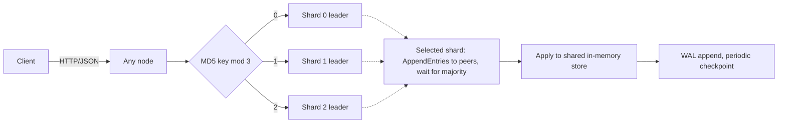

# Sharded Raft KV Store

[](https://github.com/96528025/distributed-kv/actions/workflows/ci.yml)
[](https://github.com/96528025/distributed-kv/actions/workflows/ci.yml)
[](LICENSE)

A replicated key-value store written from scratch in standard-library Python. Three node
processes talk over HTTP/JSON, keys are hashed across three independent Raft-style groups, and a
write is acknowledged only after a majority of nodes has it. The project exists to make the hard
parts of a distributed store visible and testable: leader election, replication, crash recovery
through a write-ahead log, quorum-validated reads, and Prometheus metrics.

Where behavior depends on process failure, the tests use real processes: they `SIGSTOP` a live
leader to isolate it, `SIGKILL` the whole cluster twice and check what comes back, and corrupt
bytes on disk to confirm recovery refuses to guess. Where deterministic RPC inputs say more than
scheduler-dependent elections, they drive one real node with scripted peers. 128 checks in seven
suites run in CI on Python 3.12 and 3.14.

## Quick start

Requirements: Python 3.12 or newer, `bash` and `curl`, on macOS or Linux. Nothing to install.

```bash
./start.sh start

curl -X POST http://127.0.0.1:5001/set \
  -H 'Content-Type: application/json' \
  -d '{"key":"hello","value":"world"}'

curl 'http://127.0.0.1:5002/get?key=hello'
curl http://127.0.0.1:5001/health
curl http://127.0.0.1:5001/metrics

./start.sh stop
```

The launcher starts nodes on ports `5001-5003` with the WAL backend and keeps runtime files in the
git-ignored `.run/` and `.demo-data/` directories. Any node accepts any request; a write sent to a
follower is forwarded to the shard leader and the reply carries `forwarded_by`. `KV_FSYNC=1` adds
an `fsync` after every committed batch.

To run one process by hand:

```bash
python3 node_raft_sharded.py 5001 5002 5003 --backend=wal --data-dir=.demo-data
```

Nodes bind to `127.0.0.1`. The client API and the replication RPCs share one unauthenticated,
unencrypted HTTP port, so `--host=0.0.0.0` belongs on a trusted network only.

### API

| Method | Path | Purpose |
|---|---|---|
| `POST` | `/set` | Set one string key/value through the owning shard leader |
| `GET` | `/get?key=...` | Read through the leader's quorum barrier |
| `POST` | `/delete` | Delete one key; deleting an absent key succeeds |
| `POST` | `/txn` | Multi-key write through a deliberately non-durable two-phase commit |
| `GET` | `/health` | Per-shard role, term, leader and log-window state |
| `GET` | `/metrics` | Prometheus text exposition |

`GET /all` dumps a node's local store without a quorum check, for inspection. `/debug/raft`
exposes the full Raft state and is served only when `RAFT_TEST_MODE=1`.

## What is implemented

| Area | Implementation | Evidence |
|---|---|---|
| Sharding | `MD5(key) % 3` picks a shard; each shard is an independent Raft-style group with its own term, leader and log. Every process hosts every shard and holds the full key space | `/health` shows three leaders, often on three different nodes |
| Elections | Randomized timeouts (1.5-3.0 s); `currentTerm` and `votedFor` are `fsync`ed and atomically renamed before any vote-dependent reply; candidates with stale logs are refused | Crash/restart, double-vote and log-freshness regressions |
| Writes | Forwarded to the shard leader, replicated to peers in parallel, committed once a majority acknowledges. A per-shard worker drains up to 20 queued writes into one replication round | Three-process integration suite, concurrent set/delete checks |
| Reads | Followers forward to the leader; the leader probes its peers in the current term and answers 503 unless a majority still recognizes it | Live `SIGSTOP` isolated-old-leader regression |
| Compaction | Logs over 20 entries are compacted into a snapshot; a follower behind the retained window installs the leader's snapshot | Snapshot and follower-restart checks |
| Persistence | Optional write-ahead log with CRC32-framed records and SHA-256-verified checkpoints; the legacy JSON backend rewrites the whole store per commit and stays as a baseline | Replay, torn-tail, corruption, rotation and two full-cluster `SIGKILL` cycles |
| Observability | Counters, gauges and histograms in Prometheus text format from a 230-line dependency-free module | Primitive, instrumentation and live-scrape tests |

## How it works



**Write path.** The receiving node hashes the key and forwards to the shard leader if needed. A
per-shard worker takes up to 20 queued operations, appends them to the in-memory log, and sends
`AppendEntries` to both peers concurrently. Once a majority acknowledges, the entries are applied
to the store and handed to the storage engine before the clients are answered. A majority wait
longer than one second returns an error whose outcome is unknown: the entry stays in the leader's
log and may still commit.

**Read path.** A follower forwards `/get` to the leader it last heard from. Before reading local
state, the leader sends a current-term probe to its peers and requires a majority of same-term
acknowledgements; a peer reporting a higher term makes it step down and persist that term first.
This closes the demonstrated isolated-old-leader path. It is not a full ReadIndex barrier, because
there is no separate applied-index wait; that gap is case C9 in
[`docs/RAFT_CORRECTNESS.md`](docs/RAFT_CORRECTNESS.md).

**Persistence.** Three kinds of state are kept apart on purpose:

- *Raft hard state* (`currentTerm`, `votedFor` per shard): `fsync`ed and atomically renamed
  before any dependent reply. A corrupt file or a shard-count mismatch refuses startup rather than
  resetting to term 0.
- *Raft snapshots*: the compaction boundary, used for follower catch-up.
- *State-machine WAL*: committed operations only, as `MAGIC | length | versioned JSON | CRC32`
  frames. A checkpoint is written to a temp file, `fsync`ed, atomically renamed, and only then is
  the WAL truncated (every 1,000 records or 8 MiB). Recovery trims a torn final frame; a bad
  magic, impossible length, wrong CRC or wrong checkpoint digest fails closed. Replay is idempotent
  through per-shard applied indexes.

WAL appends are flushed to the OS per commit, which survives a process crash; `KV_FSYNC=1` adds a
disk sync. Hard state and checkpoints are always `fsync`ed. Lock ordering, failure semantics and
the reasoning behind each decision are in [`docs/ARCHITECTURE.md`](docs/ARCHITECTURE.md).

## Verification

CI runs every suite on Python 3.12 and 3.14 (two matrix jobs, 128 checks each), standard library
only.

| Suite | Checks | What it exercises |
|---|---:|---|
| [`test_raft_sharded.py`](test_raft_sharded.py) | 56 | Real three-node cluster: elections, forwarding, compaction, follower restart, transactions, quorum reads, batched writes and deletes |
| [`test_raft_correctness.py`](test_raft_correctness.py) | 24 | One real node with a pinned election timeout, driven by hand-built RPCs: term/vote survive `SIGKILL`, election restriction, snapshot-boundary comparison, fail-closed topology check |
| [`test_wal.py`](test_wal.py) | 17 | Replay, torn tails, CRC and checkpoint corruption, rotation, idempotent replay, and a three-node cluster `SIGKILL`ed twice |
| [`test_http_contract.py`](test_http_contract.py) | 13 | Single-node election, 400s for malformed bodies and keys, keys containing `=`, `&` and spaces |
| [`test_metrics.py`](test_metrics.py) | 9 | Metric primitives, thread safety, instrumentation hooks, a live scrape |
| [`test_txn_routing.py`](test_txn_routing.py) | 5 | Prepare follows leader hints and unreachable-node fallback under one transaction ID; phase two targets the participant that prepared |
| [`test_read_quorum.py`](test_read_quorum.py) | 4 | Barrier logic plus a live regression: pause the leader, elect a replacement, commit a newer value, isolate the majority, wake the old leader, assert 503 instead of the stale value |
| **Total** | **128** | |

```bash
python3 test_metrics.py
python3 test_raft_sharded.py
python3 test_raft_correctness.py
python3 test_txn_routing.py
python3 test_read_quorum.py
python3 test_http_contract.py
python3 test_wal.py
```

Six suites start and stop their own node processes and clean up their own files;
`test_txn_routing.py` needs none. The cluster, WAL, HTTP-contract and read-quorum suites use real
signals and real on-disk corruption. The correctness, transaction-routing and read-barrier unit
tests replace `send_rpc` with scripted responses (unreachable peers, `not_leader` hints, stale
terms) so that each case is deterministic.

Every correctness defect found so far is logged in
[`docs/RAFT_CORRECTNESS.md`](docs/RAFT_CORRECTNESS.md) with the Raft property at risk, the
failure scenario, the fix and the regression that keeps it fixed: ten cases, two closed, one
partly closed, seven open and listed below.

## Scope boundaries

This is a subset of Raft, and the missing pieces are tracked by case number:

- Raft log durability across restarts; only term/vote and committed state are persisted (C3).
- Per-follower `nextIndex`/`matchIndex`, suffix repair and the current-term commit rule; the
  leader ships its whole retained log window and followers overwrite theirs (C4, C5).
- Ordered apply and shard-scoped snapshots; each shard's snapshot carries the shared store (C7, C8).
- A full ReadIndex barrier; reads are quorum-validated leader reads (C9).
- PreVote; an isolated node keeps raising its term and can force a healthy leader to step down
  when it rejoins (C10).
- Exactly-once writes; a timed-out write has an unknown outcome and there is no request
  deduplication (C6).
- Crash-safe transactions; `/txn` is a two-phase commit whose decisions and prepared intents live
  in memory behind a 10-second lock lease. Its success metric is named `reported_ok`, not
  `committed`.
- Power-loss durability for WAL appends unless `KV_FSYNC=1` is set.
- Dynamic membership, rebalancing, consistent hashing, authentication or TLS. Sharding spreads
  leadership and replication work; every node still holds every key.

## Observability

`GET /metrics` exports 14 bounded-cardinality metrics covering HTTP counts and latency,
elections and leader transitions, read-quorum outcomes, replication-round latency, snapshots,
transaction outcomes, and per-shard term, role, commit index and log-window size. Keys, values and
request IDs are never labels; unknown paths collapse to one `unknown` route. Names, labels and
starter queries are in [`docs/OBSERVABILITY.md`](docs/OBSERVABILITY.md).

## Benchmarks

[`benchmark_storage.py`](benchmark_storage.py) times the storage engines alone, with no HTTP or
Raft in the path. In the committed run (`benchmarks/storage_results_2026-07-23.csv`, 1,000 writes
per point, median of 3) the JSON backend falls from 1,400 to 28 ops/s as the store grows from 100
to 50,000 entries, because every commit rewrites the whole file, while WAL p50 append latency
stays at 0.008 ms across the same range. A second run on Linux (`storage_results_2026-08-20.csv`)
shows the same shape. Details in [`benchmarks/storage_benchmark.md`](benchmarks/storage_benchmark.md).

[`benchmark_raft_sharded.py`](benchmark_raft_sharded.py) measures client-observed throughput and
p50/p95/p99 latency against a three-node cluster. The committed run (`benchmarks/results.json`,
2026-07-23) used the JSON backend on one laptop and predates the read-quorum barrier, so it
supports two narrow observations and no capacity claim:

- Concurrency raised throughput: 192 ops/s at concurrency 1 versus 647 ops/s at concurrency 50
  in the median run, with p99 rising from 12 ms to 358 ms. The five concurrent trials spanned
  250-1,480 ops/s. The run has no arm with batching disabled, so the gain is consistent with the
  leader draining up to 20 queued writes per round, not a measurement of batching alone.
- Spreading keys over three shards did not help on one host: 373 ops/s against 725 ops/s with
  every key on one shard. A likely cause is that three server processes shared one CPU and
  spreading traffic shrank each shard's batches; leader placement, CPU use and actual batch depth
  were not recorded. Multi-host scaling is untested. See [`benchmarks/README.md`](benchmarks/README.md).

Smoke runs:

```bash
python3 benchmark_storage.py --quick --no-save
python3 benchmark_raft_sharded.py --quick --outdir /tmp/kv-bench   # the default outdir overwrites benchmarks/results.*
```

## Repository map

| Path | Responsibility |
|---|---|
| [`node_raft_sharded.py`](node_raft_sharded.py) | Elections, replication, routing, reads, snapshots, batching, HTTP API, 2PC (about 1,800 lines) |
| [`storage.py`](storage.py) | JSON backend, framed WAL, atomic checkpoints |
| [`metrics.py`](metrics.py) | Thread-safe Prometheus primitives and text rendering |
| [`raft_harness.py`](raft_harness.py) | Real-node and scripted-peer harness for the correctness suite |
| [`start.sh`](start.sh) | Three-node local launcher |
| [`docs/ARCHITECTURE.md`](docs/ARCHITECTURE.md) | Request flows, lock ordering, failure semantics, decision record |
| [`docs/RAFT_CORRECTNESS.md`](docs/RAFT_CORRECTNESS.md) | The ten correctness cases, closed and open |
| [`docs/LESSON_01_READ_QUORUM.md`](docs/LESSON_01_READ_QUORUM.md), [`docs/LESSON_02_TXN_LEADER_CHANGES.md`](docs/LESSON_02_TXN_LEADER_CHANGES.md) | Two failures worked from symptom to invariant to test |
| [`docs/OBSERVABILITY.md`](docs/OBSERVABILITY.md) | Metric contract |
| [`docs/EVOLUTION.md`](docs/EVOLUTION.md) | How the earlier prototypes in Git history led here |

## Roadmap

Safety before speed: durable Raft log (C3); `nextIndex`/`matchIndex` replication and the commit
rule (C4, C5); ordered apply and shard-scoped snapshots (C7, C8); a full ReadIndex barrier with
history-based tests (C9); PreVote (C10); request deduplication and recoverable transaction
decisions; then persistent connections and multi-host benchmarks. Every change starts by
reproducing a failure, names the property at risk, lands with a regression, and states what it
still does not prove.

## License

MIT. See [LICENSE](LICENSE).
