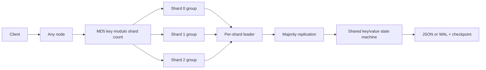

# Sharded Raft KV Store

[](https://github.com/96528025/distributed-kv/actions/workflows/ci.yml)
[](https://github.com/96528025/distributed-kv/actions/workflows/ci.yml)
[](LICENSE)

A from-scratch Python systems project that makes replication, failure handling,
durability and observability visible. It maps keys across independent replicated-log
groups and implements selected Raft mechanisms: leader election, majority-acknowledged
writes, quorum-validated leader reads, snapshot compaction and follower catch-up.

This is an experimental implementation, not a claim of complete Raft safety or a
production database. The repository pairs every implemented guarantee with executable
evidence and keeps the remaining protocol gaps explicit.

## At a glance

| Area | Current implementation | Evidence |
|---|---|---|
| Replication | One independent Raft-style group per shard; writes sent to any node are forwarded to the shard leader and acknowledged only after a majority responds | Three-process integration tests and controlled-peer correctness tests |
| Elections | Randomized elections with durable `currentTerm` and `votedFor`; candidates with stale logs are rejected | Crash/restart, double-vote and log-freshness regressions |
| Reads | Followers route reads to the leader; the leader must confirm a current-term quorum before reading local state | Live `SIGSTOP` stale-old-leader regression |
| Persistence | Compatibility JSON backend plus an optional checksummed WAL with atomic checkpoints | Replay, torn-tail repair, corruption rejection and two full-cluster `SIGKILL` cycles |
| Concurrency | Per-shard workers drain up to 20 queued writes into one replication round; peer RPCs run concurrently | Concurrent set/delete checks and preserved benchmark artifacts |
| Operations | Dependency-free Prometheus counters, gauges and histograms at `GET /metrics` | Primitive, instrumentation and live scrape tests |
| Verification | 128 checks in seven suites on Python 3.12 and 3.14 | [GitHub Actions workflow](.github/workflows/ci.yml) |

Core runtime and tests use only the Python standard library. The optional benchmark charts
use Matplotlib.

## Architecture



Each process hosts every shard and retains the complete logical key space. Sharding can
distribute leadership and replication work, but it does **not** partition storage capacity.
Membership is fixed for a run, and changing `NUM_SHARDS` has no migration path.

### Write path

1. Hash the key with `MD5(key) % NUM_SHARDS`.
2. Forward a follower request to its cached shard leader.
3. Add the operation to a per-shard queue; when the worker wakes, it drains at most 20
   currently queued writes into one round.
4. Append the batch to the leader's in-memory log and replicate it concurrently.
5. After a majority acknowledges, apply and persist the committed operations before
   returning success.

The current leader sends its complete retained log window to followers. Standard
`nextIndex`/`matchIndex` repair and the Raft current-term commit rule remain open work.

### Read path

A follower forwards `GET /get` to its known leader. Before returning local state, the
leader probes peers with AppendEntries in its current term and refuses the read if it
cannot confirm a majority. This closes the demonstrated isolated-old-leader path; it is
not a complete ReadIndex implementation because there is no independent applied-index
barrier.

### Persistence boundaries

The project deliberately separates three kinds of state:

| Artifact | What it preserves | What it does not establish |
|---|---|---|
| Raft hard state | Per-shard `currentTerm` and `votedFor`, atomically published before dependent replies | Durable Raft logs |
| Raft snapshot | A compacted log boundary and data for follower catch-up | Shard-isolated snapshots or ordered apply |
| State-machine WAL | Committed key/value operations and per-shard applied indexes | Consensus-log recovery or transaction atomicity |

WAL records use `MAGIC + length + versioned JSON payload + CRC32`. Checkpoints follow
`write temp -> fsync -> atomic replace -> fsync directory -> truncate WAL`. A partial final
frame is removed during recovery; complete framing, checksum or checkpoint corruption
fails closed.

See [Architecture and engineering decisions](docs/ARCHITECTURE.md) for request paths,
lock ordering, failure semantics and scaling constraints.

## Verified behavior and honest scope

### Verified by the current suites

- A node persists its term and vote before a vote-dependent response, survives `SIGKILL`
  and refuses a second candidate in the same term after restart.
- RequestVote compares `(lastLogTerm, lastLogIndex)`, including an empty log after
  compaction by falling back to the snapshot boundary.
- An isolated former leader refuses a stale read; after communication resumes, it
  converges to the newer value in the covered scenario.
- WAL recovery restores locally applied set/delete operations across shards, repairs a
  torn final frame and rejects interior corruption rather than silently skipping it.
- Snapshot compaction, follower restart recovery, leader forwarding, write batching,
  delete semantics, HTTP validation and bounded metric labels are exercised end to end.
- The cross-shard transaction experiment covers the failure-free path, lock conflicts,
  lock expiry and prepare routing across a leader change.

### Not claimed

- Complete Raft correctness or linearizable reads.
- Durable Raft-log recovery, standard suffix repair or `nextIndex`/`matchIndex` tracking.
- Ordered apply or shard-isolated snapshots; each current shard snapshot carries the
  shared global store.
- Crash-safe atomic transactions. Coordinator decisions and prepared intents are
  volatile, and the coordinator does not durably verify every phase-two result.
- Exactly-once requests. A timed-out write has an indeterminate outcome, and durable
  request deduplication is not implemented.
- Power-loss durability with the default state-machine WAL configuration. The `SIGKILL`
  suite verifies process-crash recovery after `flush()`; per-commit disk sync requires
  `KV_FSYNC=1`.
- Dynamic membership, rebalancing, multi-tenancy, authentication, authorization or TLS.

The detailed [Raft correctness log](docs/RAFT_CORRECTNESS.md) connects each fixed or open
case to a concrete failure scenario, invariant and regression.

## Quick start

Requirements: Python 3.12+ and `curl` on macOS or Linux.

```bash
./start.sh start

curl -X POST http://127.0.0.1:5001/set \
  -H 'Content-Type: application/json' \
  -d '{"key":"hello","value":"world"}'

curl 'http://127.0.0.1:5002/get?key=hello'
curl http://127.0.0.1:5001/health
curl http://127.0.0.1:5001/metrics

./start.sh stop
```

The launcher starts nodes on ports `5001-5003`, uses the WAL backend and stores runtime
files under ignored `.run/` and `.demo-data/` directories. Set `KV_FSYNC=1` for an `fsync`
after each committed storage batch.

To start a process directly:

```bash
python3 node_raft_sharded.py 5001 5002 5003 \
  --backend=wal --data-dir=.demo-data
```

Nodes bind to `127.0.0.1` by default. Cross-host experiments require an explicit
`--host=0.0.0.0` or `KV_HOST` setting and should run only on a trusted network because the
HTTP client API and internal replication endpoints have no authentication or encryption.

### API surface

| Method | Path | Purpose |
|---|---|---|
| `POST` | `/set` | Set one string key/value through the owning shard leader |
| `GET` | `/get?key=...` | Read through the leader's quorum barrier |
| `POST` | `/delete` | Delete one key; deleting an absent key is idempotent |
| `POST` | `/txn` | Run the deliberately non-durable multi-key 2PC experiment |
| `GET` | `/health` | Inspect per-shard role, term, leader and log-window state |
| `GET` | `/metrics` | Scrape Prometheus text exposition |

`GET /all` is an ungated inspection endpoint and does not perform per-shard quorum checks.
The more detailed `/debug/raft` endpoint is disabled unless `RAFT_TEST_MODE=1`.

## Test strategy

CI executes the full gate independently on Python 3.12 and 3.14:

| Suite | Checks | What it exercises |
|---|---:|---|
| [`test_raft_sharded.py`](test_raft_sharded.py) | 56 | Three-process elections, replication, forwarding, snapshots, restart, transactions, reads and batching |
| [`test_raft_correctness.py`](test_raft_correctness.py) | 24 | Durable election hard state, log freshness, topology mismatch and test-harness gates |
| [`test_wal.py`](test_wal.py) | 17 | WAL/checkpoint replay, torn tails, corruption, rotation and two full-cluster `SIGKILL` cycles |
| [`test_http_contract.py`](test_http_contract.py) | 13 | Single-node election, request validation and encoded query handling |
| [`test_metrics.py`](test_metrics.py) | 9 | Metric primitives, concurrency, instrumentation and a live scrape |
| [`test_txn_routing.py`](test_txn_routing.py) | 5 | Leader hints, unreachable fallback, lock conflict and exact phase-two participant routing |
| [`test_read_quorum.py`](test_read_quorum.py) | 4 | Read-barrier logic and a live isolated-old-leader failure injection |
| **Total per Python version** | **128** | Unit, controlled-peer and multi-process integration coverage |

Run the same suites locally:

```bash
python3 test_metrics.py
python3 test_raft_sharded.py
python3 test_raft_correctness.py
python3 test_txn_routing.py
python3 test_read_quorum.py
python3 test_http_contract.py
python3 test_wal.py
```

The suites use real OS processes where behavior depends on process failure: `SIGSTOP`
isolates an old leader, `SIGKILL` exercises recovery without cleanup, and on-disk test
fixtures inject torn WAL tails and checksum corruption. Controlled fake peers are used
where deterministic RPC inputs are more informative than scheduler-dependent elections.

## Observability

`GET /metrics` exports bounded-cardinality Prometheus counters, gauges and histograms for
HTTP outcomes and latency, elections, leader transitions, read-quorum results, replication
rounds, snapshot activity, transaction outcomes, terms, roles, commit indexes, log-window
sizes and prepared transactions. Keys, values and request/transaction IDs never become
labels. Metric state is process-local and resets on restart.

See the [observability contract](docs/OBSERVABILITY.md) for exact names, label sets and
starter queries.

## Benchmarks

Two reproducible drivers keep system-level and storage-level questions separate:

- [`benchmark_raft_sharded.py`](benchmark_raft_sharded.py) measures client-observed
  throughput and p50/p95/p99 latency across reads, writes, transactions, concurrency,
  batching and shard distribution.
- [`benchmark_storage.py`](benchmark_storage.py) isolates the legacy full-JSON rewrite
  from WAL append, checkpoint and recovery costs.

The preserved cluster results are a historical single-laptop run using the legacy JSON
backend and predate the current read-quorum path. They support a narrow observation:
concurrent batching improved write throughput by roughly 2-3x in those trials while
increasing tail latency. They are not current capacity numbers and do not establish
multi-host scaling. See the [cluster benchmark methodology](benchmarks/README.md) and
[storage benchmark methodology](benchmarks/storage_benchmark.md) with raw JSON/CSV data.

Quick smoke runs:

```bash
python3 benchmark_raft_sharded.py --quick
python3 benchmark_storage.py --quick --no-save
```

## Repository map

| Path | Responsibility |
|---|---|
| [`node_raft_sharded.py`](node_raft_sharded.py) | Elections, replication, routing, reads, snapshots, batching and 2PC experiment |
| [`storage.py`](storage.py) | JSON compatibility backend, framed WAL and atomic checkpoints |
| [`metrics.py`](metrics.py) | Thread-safe Prometheus primitives and text rendering |
| [`raft_harness.py`](raft_harness.py) | Deterministic real-node and controlled-peer correctness harness |
| [`docs/ARCHITECTURE.md`](docs/ARCHITECTURE.md) | Request flows, concurrency, failure semantics and design decisions |
| [`docs/RAFT_CORRECTNESS.md`](docs/RAFT_CORRECTNESS.md) | Fixed, partial and open correctness cases |
| [`docs/EVOLUTION.md`](docs/EVOLUTION.md) | Evolution from naive replication to the current design |

Earlier prototypes remain in Git history rather than competing with the current
implementation on the default branch.

## Prioritized roadmap

1. Persist and recover the Raft log before acknowledging dependent RPCs.
2. Add per-follower `nextIndex`/`matchIndex`, suffix repair and the current-term commit rule.
3. Make snapshots shard-scoped and serialize state-machine apply by log index.
4. Complete ReadIndex semantics and add history-based linearizability tests.
5. Add durable request deduplication and recoverable coordinator/participant decisions.
6. Evaluate persistent transports and controlled multi-host benchmarks only after the
   safety work above.

The development rule is intentionally simple: reproduce a failure, name the property at
risk, implement the smallest defensible fix, preserve it as a regression and state what
the fix still does not prove.
