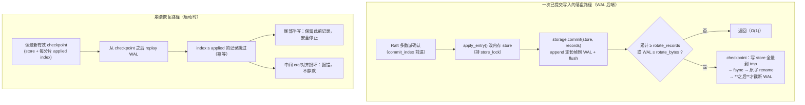

# Distributed KV Store / 分布式键值存储引擎

A distributed key-value store built from scratch in Python — evolving from a simple 3-node replicated store all the way to per-shard Raft consensus groups, the architecture used by CockroachDB and TiKV. Deployed across 3 AWS regions.

Demonstrates core distributed systems concepts: Raft consensus, leader election, log replication, log snapshot compaction, consistent hashing sharding, linearizable reads, two-phase commit (2PC) transactions, batch writes, fault tolerance, and disk persistence.

用 Python 从零手写的分布式 KV 存储引擎，从最简单的 3 节点同步一路演进到每分片独立 Raft 共识组（CockroachDB / TiKV 的核心架构），部署在 AWS 三大洲。

涵盖核心分布式系统概念：Raft 共识、选主、日志复制、日志快照压缩、一致性哈希分片、线性化读、两阶段提交（2PC）事务、批量写入、故障容忍、持久化。

> 附带演示：在 v1 KV store 上构建了一个分布式实时聊天室（WebSocket），验证存储层的可用性。未来计划在更完善的分布式系统上重建聊天室。

---

## Verified: 56/56 automated tests passing / 自动化测试全部通过

The full Raft + sharding + transaction suite is reproducible in one command — no external dependencies, it spins up a real 3-node cluster on `localhost:5001-5003`:

一条命令即可复现完整的 Raft + 分片 + 事务测试，无需外部依赖，会真实拉起 `localhost:5001-5003` 三节点集群：

```console
$ python3 test_raft_sharded.py
  ✅ PASS  集群启动并完成选举
  ✅ PASS  向非 Leader 写入（自动转发到 Leader）
  ✅ PASS  日志快照压缩（写满 60 条触发快照，log 截断至 20）
  ✅ PASS  节点重启后从快照恢复，数据不丢
  ✅ PASS  Follower 落后拉快照（install_snapshot）
  ✅ PASS  多 key 事务提交 / 锁冲突 abort / 锁超时自动释放
  ✅ PASS  线性化读（Leader 直读，Follower 转发）
  ✅ PASS  10 并发写入 + 5 并发删除全部成功
  ...
───────────────────────────────────────────────────────
  🎉 全部通过：56/56
───────────────────────────────────────────────────────
```

Covers leader election, log replication, snapshot compaction & recovery, `install_snapshot` catch-up, 2PC multi-key transactions (commit / lock-conflict abort / lock-timeout release), linearizable reads, and concurrent batch writes/deletes.

---

## Architecture / 架构

### Chat System (v1 KV + chat servers) / 聊天系统架构

```
[You / 你]
    │  WebSocket
    ▼
┌─────────────────┐   ┌─────────────────┐   ┌─────────────────┐
│  Chat Server    │   │  Chat Server    │   │  Chat Server    │
│  Virginia :9001 │   │  Oregon  :9002  │   │  Ireland :9003  │
└────────┬────────┘   └────────┬────────┘   └────────┬────────┘
         │                     │                     │
         └─────────────────────┼─────────────────────┘
                               │ HTTP (lpush / lrange)
         ┌─────────────────────┼─────────────────────┐
         ▼                     ▼                     ▼
┌─────────────────┐   ┌─────────────────┐   ┌─────────────────┐
│   KV Node       │◄──│   KV Node       │──►│   KV Node       │
│  Virginia :5001 │   │  Oregon  :5002  │   │  Ireland :5003  │
│  👑 Leader      │   │  🔄 Follower    │   │  🔄 Follower    │
└─────────────────┘   └─────────────────┘   └─────────────────┘
```

- **Chat Servers** are stateless — any one can go down, clients auto-reconnect
- **KV Cluster** stores all message history — persisted to disk, replicated across 3 continents
- Write to Virginia → automatically synced to Oregon and Ireland

### Latest KV Architecture (v5: node_raft_sharded.py) / 最新 KV 架构

```
每个分片独立运行一个 Raft 共识组，三个分片可能有三个不同的 Leader：

分片 0: Raft Group → Leader 可能在 5001 / 5002 / 5003 任意节点
分片 1: Raft Group → Leader 可能在不同节点
分片 2: Raft Group → Leader 可能在不同节点

所有节点存全量数据，写入路由到对应分片的 Leader，读取路由到 Leader（线性化读）
```

---

## Persistence: WAL + Checkpoint / 持久化：预写日志 + 检查点

> 代码：[`storage.py`](storage.py)（存储引擎）· 集成点在 [`node_raft_sharded.py`](node_raft_sharded.py)
> · 测试 [`test_wal.py`](test_wal.py) · 基准 [`benchmark_storage.py`](benchmark_storage.py) / [`benchmarks/storage_benchmark.md`](benchmarks/storage_benchmark.md)

### 原持久化路径的问题 / The problem

旧的 `save_to_disk()` **每次提交都把整个 store 全量重写成一个 JSON 文件**
（`json.dump(store)`）。单次提交的磁盘成本是 **O(数据量)**：库里有 N 条，
每写 1 条就要把 N 条全部序列化落盘一次。实测（[基准](benchmarks/storage_benchmark.md)）：
数据从 100 → 50,000 条时，单次写吞吐从 **1400 → 28 ops/s（跌约 50×）**，
p50 延迟从 **0.72ms → 35ms（涨约 49×）**。这是纯粹的写放大。

### 新架构 / The architecture

引入 `StorageEngine` 抽象，两个后端实现同一套接口，通过配置/命令行选择：

| 后端 | 说明 | 单次写成本 |
|---|---|---|
| **`json`**（默认，legacy） | 保留旧的全量重写路径，向后兼容、作为基准对照 | O(数据量) |
| **`wal`**（opt-in） | append-only WAL + 原子 checkpoint 恢复 | O(1) 追加，checkpoint 时摊薄一次 O(N) |

> **默认仍是 `json`**：保证现有行为与 56/56 测试**零改动**；WAL 为显式开启（opt-in），
> 见下方「如何选择 backend」。这样升级不冒任何回归风险，WAL 的收益按需启用。



### 写入流程 / Write flow（只持久化已提交操作）

1. Raft 达成多数派 → 该条目 committed，`commit_index` 前进；
2. 在 `store_lock` 内 `apply_entry()` 改内存 store；
3. **同一个 `store_lock` 临界区**内调用 `storage.commit(store, records)`：
   把每条 committed 操作编码成一条**定长帧 WAL 记录**并 append，然后 `flush()`；
4. 若累计记录数 / 文件大小达阈值 → 触发一次 checkpoint（见下）并轮换 WAL。

所有已提交的状态机 apply 路径（batch 写、事务 commit 逐条、follower apply、
安装快照）**都走这一条统一的 persistence path**，不会出现「set 有 WAL、delete 没有」
或「Leader 有、Follower 没有」这类漏写。

### WAL 记录格式 / Record format（length-prefixed，可靠识别半写）

```
每条记录：MAGIC(4) | payload_len(4, 大端) | payload(JSON) | crc32(4, 大端)
payload = {v:版本, s:shard_id, i:绝对index, t:term, o:op, k:key, d:value}
```

- **MAGIC** 用于校验「帧对齐」，把**中间损坏**（错位）与**尾部半写**（截断）区分开；
- **crc32** 覆盖 payload，检测内容损坏；
- 定长长度前缀让 replay **不依赖换行完整**，可靠识别最后一条 partial write。

### 恢复流程 / Recovery flow

启动时 `storage.load()`：
1. 加载最新有效 checkpoint → 得到 store 全量 + 每个分片的 `applied` 绝对 index；
2. 从 WAL 顺序 replay，**只应用 `index > applied[shard]` 的记录**（幂等去重）；
3. 正确恢复 `set` / `delete`；
4. **尾部 partial record**：保留此前所有有效记录并安全停止；
5. **中间 checksum / 帧对齐损坏**：抛 `StorageCorruptionError`，**绝不静默继续**。

Replay 幂等，可安全重复执行。

### Checkpoint 的原子发布顺序 / Atomic checkpoint ordering（崩溃安全）

checkpoint 包含：当前 store 全量、每个分片已应用到的绝对 index、版本 + sha256 校验。
发布严格按此顺序，**核心不变式：checkpoint 必须 fsync+rename 落盘后，才允许截断 WAL**：

1. 把 store 全量 + applied 写到 `checkpoint_<port>.json.tmp`，`flush()` + **`fsync()`**；
2. `os.replace(tmp, final)` **原子** rename 发布（+ 对目录 fsync 让 rename 持久）；
3. **只有** checkpoint 安全落盘后，才截断/轮换 WAL。

对应四个崩溃点都安全：

| 崩溃点 | 结果 | 为什么安全 |
|---|---|---|
| checkpoint 只写了一半 | 只污染 `.tmp` | final checkpoint 未变，恢复用旧 checkpoint + 全量 WAL |
| checkpoint 完成但 WAL 未轮换 | 新 checkpoint 生效 + WAL 仍有旧记录 | replay 时 `index ≤ applied` 被跳过，不重复应用 |
| WAL 准备轮换但旧文件仍在 | 同上 | replay 幂等 |
| checkpoint 与清理旧日志之间退出 | 同上 | replay 幂等，既不丢也不重放 committed 操作 |

### Durability policy / 持久性策略

- **`flush()` ≠ `fsync()`**（本项目明确区分，不混淆）：
  - `flush()` 把字节从 Python 缓冲交给 **OS 页缓存** → 足以扛**进程崩溃 / `kill -9`**
    （进程死了，页缓存还在，OS 稍后自然落盘）；
  - `fsync()` 才把数据推到**物理磁盘** → 才能扛**掉电 / OS 崩溃**。
- **默认策略**：每次 committed batch 后 `flush()`；`fsync` **可配置，默认关**（性能优先）。
  `test_wal.py` 的 SIGKILL 集成测试证明：即便不 fsync，`flush()` 也能扛住强杀恢复。
- **checkpoint 一律 fsync**：它是恢复的唯一可信基点，且顺序上先于 WAL 截断。
- 打开掉电级持久：`--fsync`（或 `KV_FSYNC=1`），每次写多一次磁盘同步，吞吐会下降。

### Raft log 与 storage WAL 的区别 / Raft log vs storage WAL（关键概念）

| | **Raft log**（`shard.log`） | **Storage WAL**（`wal_<port>.log`） |
|---|---|---|
| 目的 | **多节点复制与共识** | **单节点磁盘持久化与崩溃恢复** |
| 内容 | 尚未 committed 也可能包含 | **只有已 committed、准备 apply 的操作** |
| 作用域 | 一个 Raft 组（跨节点） | 一个进程（本机） |
| 可变性 | 未提交条目可能因冲突被截断/覆盖 | 只追加已提交操作（提交后不再改变） |

**为什么 WAL 只记录已 committed 操作？** 因为 storage WAL 的职责是「让本节点崩溃后能恢复
到它已经确认的状态机状态」。未提交的 Raft 条目还可能被更高 term 的 Leader 覆盖，
把它们持久化进状态机 WAL 会导致恢复出「从未真正提交过」的数据。Raft 的复制/持久由
`shard.log` 及快照负责；storage WAL 站在**状态机之后**，只接收已定稿的操作。

### 如何选择 backend / Selecting a backend

命令行 `--flag` 优先，其次同名环境变量，最后默认值：

```bash
# 默认 json（legacy，行为与旧版一致）
python3 node_raft_sharded.py 5001 5002 5003

# 开启 WAL 后端
python3 node_raft_sharded.py 5001 5002 5003 --backend=wal
KV_BACKEND=wal python3 node_raft_sharded.py 5001 5002 5003

# 其它可选项
--data-dir=PATH        # (KV_DATA_DIR)        状态文件目录，默认当前目录
--fsync                # (KV_FSYNC=1)         每次 commit 后 fsync（掉电级持久）
--rotate-records=N     # (KV_ROTATE_RECORDS)  WAL 轮换阈值（条），默认 1000
```

---

## Features / 功能

**Distributed KV Store**
- Data replication — write to any node, all nodes sync automatically / 写入一个节点，所有节点自动同步
- Disk persistence — every write saved to disk / 每次写入同时存磁盘，重启不丢数据
- Fault tolerance — cluster keeps working when a node goes down / 节点挂掉，集群继续工作
- Log snapshot compaction (v5) — log truncated after threshold; restart restores from local snapshot file / 日志超过阈值自动压缩，重启从本地快照恢复
- Raft consensus leader election (v5) / simple min-port election (v1) / Raft 共识选主（v5）/最小端口当 Leader（v1）
- Auto redirect — non-leader automatically forwards writes/reads to shard leader / 非 Leader 自动转发请求到分片 Leader
- Multi-key transactions via 2PC (v5) — atomically write across shards / 跨分片原子事务（v5）
- Batch writes (v5) — concurrent requests merged into one Raft round / 批量写入，并发请求合并（v5）
- List type — `lpush` / `lrange` for storing message history (v1/v2) / 列表类型，用于存储聊天历史（v1/v2）
- Split-brain demo — simulate network partition with `isolate`/`heal` (v1) / 脑裂演示（v1）

**Distributed Chat**
- Multi-server — 3 Chat Servers across 3 regions, clients auto-reconnect on failure / 三大洲三台服务器，断线自动重连
- Message history — new users receive last 50 messages on connect / 新用户连接自动推送历史消息
- Persistent messages — chat history survives full cluster restart / 聊天记录跨重启保存
- Cross-machine peers — KV nodes communicate via real public IPs / KV 节点通过真实公网 IP 互相通信

---

## Load Test Results / 压力测试结果

| Users / 用户数 | Success Rate / 成功率 | Throughput / 吞吐量 | Avg Latency / 平均延迟 |
|---------------|----------------------|--------------------|-----------------------|
| 50            | 100%                 | 41.5 msg/s         | 0.04ms                |
| 200           | 100%                 | 163 msg/s          | 0.04ms                |
| 1000          | 25%                  | 200 msg/s          | 0.03ms                |

**Bottleneck / 瓶颈：** Connection count per Chat Server (~80 concurrent), not latency. Linear scaling — doubling servers doubles capacity. KV write throughput is limited by single leader; needs sharding to scale further.

瓶颈在每台 Chat Server 的连接数（约 80 并发），而非延迟。水平扩展有效：加一台服务器，容量线性增加。KV 写入瓶颈在单 Leader，需分片突破。

> ⚠️ 以上压测数据基于 v1 KV（`node.py`）+ 聊天服务器，不代表 v5（`node_raft_sharded.py`）的性能。v5 加入了 Raft 共识和批量写入，吞吐量特性不同。
> These results are for the v1 KV + chat system, not v5.

---

## How to Run / 如何运行

### Local / 本地运行

```bash
# Terminal 1: start KV cluster (v1) / 启动 KV 集群
bash start.sh

# Terminal 2: start Chat Servers / 启动聊天服务器
python3 chat_server.py 9001 &
python3 chat_server.py 9002 &
python3 chat_server.py 9003 &

# Terminal 3+: connect as user / 连接聊天室
python3 chat_client.py

# Load test / 压力测试
python3 load_test.py

# ── 或运行最新 v5 KV 集群 ──
python3 node_raft_sharded.py 5001 5002 5003 &
python3 node_raft_sharded.py 5002 5001 5003 &
python3 node_raft_sharded.py 5003 5001 5002 &
sleep 5

# 运行自动化测试 / Run automated tests
python3 test_raft_sharded.py          # 现有集群测试（56/56）
python3 test_wal.py                    # WAL 存储引擎测试（15/15，含 SIGKILL 恢复）
python3 test_wal.py --unit-only        # 只跑快速存储层单元测试（13 个，秒级）

# 持久化后端基准（JSON 全量重写 vs WAL 追加）/ Storage backend benchmark
python3 benchmark_storage.py           # 见 benchmarks/storage_benchmark.md
python3 benchmark_storage.py --quick   # 快速冒烟
```

### Cloud (AWS) / 云端运行

```bash
# On each EC2 instance / 每台 EC2 上运行：
git clone https://github.com/96528025/distributed-kv.git
cd distributed-kv
pip3 install websockets

# Virginia (us-east-1)
python3 node.py 5001 <oregon-ip>:5002 <ireland-ip>:5003 &
python3 chat_server.py 9001 <virginia-ip>:5001 <oregon-ip>:5002 <ireland-ip>:5003 &

# Oregon (us-west-2)
python3 node.py 5002 <virginia-ip>:5001 <ireland-ip>:5003 &
python3 chat_server.py 9002 <virginia-ip>:5001 <oregon-ip>:5002 <ireland-ip>:5003 &

# Ireland (eu-west-1)
python3 node.py 5003 <virginia-ip>:5001 <oregon-ip>:5002 &
python3 chat_server.py 9003 <virginia-ip>:5001 <oregon-ip>:5002 <ireland-ip>:5003 &
```

**Required AWS Security Group ports / 需要开放的端口：**
- 22 (SSH), 5001-5003 (KV cluster), 9001-9003 (Chat Servers)

---

## Project Structure / 项目结构

### KV Node Versions / KV 节点版本演进

五个版本按顺序构建，每个版本解决上一个的核心缺陷：

| File / 文件 | Version | What it does / 功能 |
|-------------|---------|---------------------|
| `node.py` | v1 | 最简单版本。Leader = 存活节点中端口最小的（非共识）。写入只有 Leader 接受，同步给其他节点。支持字符串和列表类型，有脑裂演示（/isolate /heal）。**聊天系统用的是这个** |
| `node_sharded.py` | v2 | 加入一致性哈希分片：`MD5(key) % 3` 决定哪个节点负责哪个 key，每个节点都是自己 key 的 "owner"，写入可以并行。缺陷：节点挂了，它负责的那部分 key 就读不了 |
| `node_raft.py` | v3 | 实现真正的 Raft 共识算法（随机超时选举 + 日志复制 + 心跳 + 任期）。但只有一个全局 Raft group，没有分片，写入还是单点瓶颈 |
| `node_replicated.py` | v4 | 分片 + 全量副本：每个分片有 primary，所有节点存全量数据，读任意节点都行。缺陷：primary 选举靠简单存活检查，不是 Raft，宕机前未同步的写入会丢 |
| `node_raft_sharded.py` | **v5** | 每个分片独立运行一个 Raft group（CockroachDB / TiKV 的核心架构）。含：日志快照压缩、两阶段提交（2PC）事务、线性化读、批量写入、/delete。当前最完整的版本 |

### Chat System / 聊天系统

| File / 文件 | What it does / 功能 |
|-------------|---------------------|
| `chat_server.py` | WebSocket 聊天服务器。无状态，所有消息通过 `/lpush` 存到 v1 KV；新用户连接时用 `/lrange` 拉取最近 50 条历史。多台并行运行，任一台挂了不影响其他 |
| `chat_client.py` | 聊天客户端。两个并发 async task（收/发）确保断线立刻检测到，自动重连其他 Chat Server |
| `load_test.py` | 压力测试脚本。模拟最多 1000 个并发用户同时发消息，统计成功率 / 吞吐量 / 平均延迟 |

### Tools & Scripts / 工具与脚本

| File / 文件 | What it does / 功能 |
|-------------|---------------------|
| `client.py` | 交互式命令行客户端，手动操作 v1 KV store（get / set / lpush / lrange 等） |
| `storage.py` | **持久化引擎抽象**：`StorageEngine` 接口 + `JsonStorageEngine`（legacy 全量重写）+ `WalStorageEngine`（WAL + 原子 checkpoint 恢复）。详见 [Persistence 章节](#persistence-wal--checkpoint--持久化预写日志--检查点) |
| `test_raft_sharded.py` | v5 的全自动测试套件（56 个用例，约 30s）。覆盖：读写、Leader 转发、快照压缩、节点重启恢复、2PC 事务、锁冲突、锁超时、/delete、线性化读、批量写入 |
| `test_wal.py` | WAL 存储引擎测试（15 个用例，含真实节点 SIGKILL 恢复集成测试）。覆盖：set/delete/多分片/batch/事务恢复、幂等 replay、尾部半写、checksum 损坏、无效 checkpoint、轮换后恢复、JSON 兼容 |
| `benchmark_storage.py` | 公平对比 legacy JSON 全量重写 vs WAL 追加（吞吐 / p50-p99 延迟 / 数据规模 / 存储增长 / 恢复时间 / batching）。结果见 [`benchmarks/storage_benchmark.md`](benchmarks/storage_benchmark.md) |
| `start.sh` | 一键启动 3 个 v1 KV 节点（端口 5001/5002/5003） |
| `start_chat.sh` | 一键启动 3 个 Chat Server（端口 9001/9002/9003），需先运行 `start.sh` |

---

## API Endpoints / API 接口

### v5: node_raft_sharded.py（最新版）

| Method | Path | Description |
|--------|------|-------------|
| GET | `/get?key=<k>` | read a value — routes to shard leader (linearizable) / 线性化读，路由到分片 Leader |
| GET | `/all` | dump all data / 查看所有数据 |
| GET | `/health` | per-shard Raft state (role, term, leader, log_length...) / 各分片 Raft 状态 |
| POST | `/set` | write a key-value pair (batched, Raft-replicated) / 写入（批量合并，Raft 复制） |
| POST | `/delete` | delete a key (Raft-replicated) / 删除 key（Raft 复制） |
| POST | `/txn` | multi-key atomic transaction — 2PC coordinator / 多 key 原子事务（协调者） |
| POST | `/txn_prepare` | lock keys and stage intent — shard leader internal / 锁定 key，暂存意图（内部） |
| POST | `/txn_commit` | commit transaction via Raft — shard leader internal / 通过 Raft 提交事务（内部） |
| POST | `/txn_abort` | abort transaction, release locks — internal / 中止事务，释放锁（内部） |
| POST | `/install_snapshot` | follower requests full snapshot from leader — internal / Follower 向 Leader 拉取快照（内部） |
| POST | `/append_entries` | Raft log replication RPC — internal / Raft 日志复制（内部） |
| POST | `/vote` | Raft vote request RPC — internal / Raft 投票（内部） |

### v1: node.py + chat system（早期版 / 聊天系统）

| Method | Path | Description |
|--------|------|-------------|
| GET | `/get?key=<k>` | read a string value / 读取字符串值 |
| GET | `/lrange?key=<k>&start=0&end=49` | read a list range / 读取列表片段 |
| GET | `/all` | dump all data / 查看所有数据 |
| GET | `/health` | health check / 健康检查 |
| GET | `/snapshot` | full data dump for peer recovery / 全量快照（供 peer 拉取恢复） |
| GET | `/leader` | current leader info / 查看当前 Leader |
| GET | `/isolate` | enter isolated mode (split-brain demo) / 进入孤立模式 |
| GET | `/heal` | exit isolated mode / 退出孤立模式 |
| POST | `/set` | write a string value / 写入字符串 |
| POST | `/lpush` | append to a list / 列表追加 |
| POST | `/internal` | receive replicated data from peers / 接收同步数据 |

---

## Build Log / 开发日志

### Day 1 — Distributed KV Store / 第一天：分布式 KV 存储

Built a Redis-inspired distributed KV store from scratch with 3 nodes.

从零手写分布式 KV 存储，3个节点互相同步。

**Problems & Solutions / 遇到的问题：**

| Problem / 问题 | Solution / 解决方法 |
|---------------|-------------------|
| `Address already in use` | `pkill -9 -f "node.py"` 清理残留进程 |
| Writing to follower showed "no response" | urllib 把 403 当 HTTPError 抛出，单独 catch 处理 |
| `global isolated` syntax error | 同一方法两处声明，改为方法顶部声明一次 |
| Split-brain not working | 孤立只阻止发出，忘了阻止接收，在 `/internal` 加孤立检查 |

---

### Day 2 — WebSocket Chat + Distributed Upgrade / 第二天：WebSocket 聊天室 + 分布式升级

Added list type to KV store, built Chat Servers on top, load tested.

给 KV 存储加列表类型，在上面建聊天服务器，压力测试。

**Key decisions / 关键设计决策：**
- Chat Servers are stateless — all state lives in KV cluster
- Messages stored with `lpush`, history fetched with `lrange`
- Client uses two concurrent async tasks (recv + send) so disconnect is detected immediately

**Problems & Solutions / 遇到的问题：**

| Problem / 问题 | Solution / 解决方法 |
|---------------|-------------------|
| Client didn't auto-reconnect on disconnect | `input()` blocks — switched to two concurrent asyncio tasks; whichever finishes first triggers reconnect |
| Load test: 17/50 connections failed with 2 servers | Started 3rd Chat Server → 50/50 success |
| Load test bottleneck at 1000 users | ~80 concurrent connections per server; fix = add more servers |

---

### Day 3 — AWS Cloud Deployment + Sharding + Raft / 第三天：AWS 云端部署 + 分片 + Raft

**Consistent Hashing Sharding (`node_sharded.py`) / 一致性哈希分片**

Each key is assigned to a node via `MD5(key) % num_nodes`. Writes and reads automatically forwarded to the correct node. No single leader bottleneck — all nodes handle writes in parallel.

每个 key 通过 `MD5(key) % 节点数` 分配到固定节点。写入和读取自动转发给正确节点，三台都能处理写入，无单点瓶颈。

```
set user:alice  → hash → node 5001 (direct write)
set chat:msg    → hash → node 5002 (forwarded)
set cache:home  → hash → node 5003 (forwarded)
```

**Raft Consensus Algorithm (`node_raft.py`) / Raft 共识算法**

Replaces fake "min port = leader" with real consensus:
- **Terms**: monotonically increasing epoch; stale leaders step down automatically
- **Election**: randomized timeouts → first to timeout requests votes → majority wins
- **Log replication**: writes appended to log first, committed only after majority ACK
- **Heartbeats**: leader sends periodic heartbeats to prevent unnecessary re-elections

替换掉"最小端口当 Leader"的假方案，实现真正的共识：
- **任期**：单调递增，过期 Leader 自动下台
- **选举**：随机超时，先超时的发起投票，多数票当选
- **日志复制**：写入先进日志，多数节点确认后才 commit
- **心跳**：Leader 定期发心跳，防止不必要的重新选举

**Problems & Solutions / 遇到的问题：**

| Problem / 问题 | Solution / 解决方法 |
|---------------|-------------------|
| Raft node kept re-electing before peers started | Normal behavior — no majority available until all 3 nodes up; won on Term 42 once all started |
| Term number jumped to 42 | Each failed election increments term; expected when nodes start one by one |

---

### Day 3b — AWS Cloud Deployment / 第三天：AWS 云端部署

Deployed the full stack across 3 AWS EC2 regions.

把整个系统部署到 AWS 三大洲的 EC2 上。

**Problems & Solutions / 遇到的问题：**

| Problem / 问题 | Solution / 解决方法 |
|---------------|-------------------|
| `node.py` only supported `localhost` peers | Updated to parse `IP:PORT` format: `python3 node.py 5001 54.x.x.x:5002 54.x.x.x:5003` |
| `Permission denied` writing `data_5001.json` | `sudo git clone` created root-owned files → `sudo chown -R ec2-user:ec2-user /opt/distributed-kv` |
| `git: command not found` on EC2 | `sudo dnf install -y git` |
| `pip3: command not found` on EC2 | `sudo dnf install -y python3-pip` |
| Chat Server unreachable from outside | Bound to `"localhost"` instead of `"0.0.0.0"` — fixed in `websockets.serve()` |
| SSH terminal freezing | Background node.py logs flooding input; reconnected and used `&` for background processes |
| Wrong SSH key for Oregon | Key named `distributed-system-key-euwest.pem` was actually for Oregon (misnamed at creation time) |
| zsh treating `?` as wildcard in curl | Wrapped URL in quotes: `curl "http://host:port/get?key=hello"` |

---

### Day 4 — Sharding + Full Replication (`node_replicated.py`) / 第四天：分片 + 全量副本

Best of both worlds: consistent hashing sharding (no single write bottleneck) + full replication (every node stores all data, reads from any node).

结合分片和副本的优点：一致性哈希分片（无单点写瓶颈）+ 全量副本（每个节点存所有数据，可从任意节点读）。

**Architecture / 架构：**
- 3 shards, each shard has a primary; all nodes store all data / 3个分片，每个分片有primary，所有节点存全量数据
- Writes go to the shard's primary, which replicates to all peers / 写入发给分片primary，primary同步给所有节点
- Primary assignment: round-robin by shard index; auto-failover to next alive node / Primary按分片索引轮流分配，挂了自动切下一个存活节点
- Background health check thread (every 2s) detects node failures and updates primary mapping / 后台健康检查线程（每2s）检测节点存活，自动更新primary

```
分片 0: primary=5001, 候补=[5002, 5003]
分片 1: primary=5002, 候补=[5001, 5003]  ← 5002挂了 → 5003接管
分片 2: primary=5003, 候补=[5001, 5002]
```

**Problems & Solutions / 遇到的问题：**

| Problem / 问题 | Solution / 解决方法 |
|---------------|-------------------|
| Health check loop held `alive_lock` while making HTTP requests → deadlock with single-threaded HTTP server | Collect ping results outside the lock first, then update state under lock / 先在锁外ping，再加锁更新，避免持锁期间发HTTP请求导致死锁 |

---

### Day 5 — Per-Shard Raft Groups (`node_raft_sharded.py`) / 第五天：每个分片独立 Raft

Combined sharding with per-shard Raft consensus — the architecture used by CockroachDB and TiKV.

将分片与 Raft 共识结合，每个分片独立运行一个 Raft 共识组——这正是 CockroachDB / TiKV 的核心架构。

**Architecture / 架构：**
```
分片 0: Raft Group → 独立选 Leader（可能是5001/5002/5003中任意一个）
分片 1: Raft Group → 独立选 Leader
分片 2: Raft Group → 独立选 Leader

所有节点存全量数据（全量副本），每个分片的写入由该分片的 Raft Leader 负责
```

**Key improvements over `node_replicated.py` / 对比 node_replicated.py 的改进：**

| Feature / 特性 | node_replicated.py | node_raft_sharded.py |
|---------------|-------------------|----------------------|
| Leader election | Simple alive-check / 简单存活检查 | Raft consensus / Raft 共识 |
| Write safety | Lost if primary crashes before sync / primary 宕机可能丢写入 | Committed only after majority ACK / 多数确认才 commit |
| Parallel writes | Yes (different shards) / 是 | Yes (different shard Leaders) / 是 |
| Reads | Any node / 任意节点 | Any node / 任意节点 |

**Key design / 关键设计：**
- `ShardRaft` class holds per-shard Raft state (term, log, commit_index, leader_id, etc.) / 每个分片独立的 Raft 状态类
- All RPCs carry `shard_id` to route to the correct Raft group / 所有 RPC 携带 shard_id 路由到正确的 Raft 组
- `election_timer()` iterates all shards independently / election_timer 遍历所有分片独立计时
- `heartbeat_loop()` sends heartbeats for each shard where this node is Leader / 心跳循环按分片独立发送
- `store_lock` and `shard.lock` never held simultaneously — avoids deadlock / 两把锁不同时持有，避免死锁

**Verification / 验证：**
```bash
# 启动三个节点
python3 node_raft_sharded.py 5001 5002 5003 &
python3 node_raft_sharded.py 5002 5001 5003 &
python3 node_raft_sharded.py 5003 5001 5002 &
sleep 5

# 查看各分片 Leader（三个分片可能有不同 Leader）
curl http://localhost:5001/health

# 写入（转发到正确分片的 Leader + 多数确认）
curl -X POST http://localhost:5001/set -d '{"key":"user:alice","value":"30"}'

# 从任意节点读取（全量副本，任意节点都能读）
curl "http://localhost:5001/get?key=user:alice"
curl "http://localhost:5002/get?key=user:alice"
curl "http://localhost:5003/get?key=user:alice"

# Kill 某个分片的 Leader，验证该分片自动重新选举
pkill -f "node_raft_sharded.py 5002"
sleep 5
curl http://localhost:5001/health   # 分片重新选了新 Leader
curl -X POST http://localhost:5001/set -d '{"key":"chat:msg","value":"after leader change"}'
```

**Problems & Solutions / 遇到的问题：**

| Problem / 问题 | Solution / 解决方法 |
|---------------|-------------------|
| Deadlock risk: shard.lock held during disk write | shard.lock and store_lock never held simultaneously; collect data under shard.lock, apply under store_lock / 两把锁分开持有，先在 shard.lock 内收集数据，再在 store_lock 内写磁盘 |
| Forwarding loop risk: Leader sends to self | Check shard role before forwarding; only forward when role != LEADER / 转发前检查角色，只有非 Leader 才转发 |
| Multiple shards timing out simultaneously | Each ShardRaft has independent random election_timeout; Raft term numbers prevent split votes / 每个分片独立随机超时，任期编号防止裂票 |

---

### Day 5b — Log Snapshot Compaction + Multi-key Transactions / 第五天 b：日志快照压缩 + 多 key 事务

Two new features added to `node_raft_sharded.py`.

在 `node_raft_sharded.py` 基础上增加两个功能。

**Feature 1: Log Snapshot Compaction / 日志快照压缩**

Without snapshots, the Raft log grows forever — restarting a node replays all history.
With snapshots, the log is truncated after each commit batch; a restarting node loads the snapshot and only replays the small tail.

没有快照时，Raft 日志无限增长——节点重启需重放所有历史。加快照后，每次超过阈值就截断旧日志，重启只需从快照 + 少量尾部日志恢复。

- `SNAPSHOT_THRESHOLD = 20` — trigger after 20 log entries (small for demo) / 超过20条触发（演示用小值）
- Each shard saves `snapshot_{PORT}_shard{N}.json` with store state + log metadata / 每个分片保存独立快照文件
- Follower that falls too far behind fetches snapshot from Leader via `POST /install_snapshot` / 落后太多的 Follower 主动向 Leader 拉快照
- `log_offset` field tracks absolute index of `log[0]`; `commit_index` is always absolute / 绝对 index 设计，重启后计算正确

**Feature 2: Multi-key Transactions (2PC) / 多 key 事务（两阶段提交）**

Atomically write multiple keys across different shards — all succeed or all fail.

原子地跨多个分片写入多个 key——要么全成功，要么全失败。

```
客户端 → POST /txn → 协调者节点
  Phase 1: 并发向各分片 Leader 发 /txn_prepare → 锁定 key
  全部 READY → Phase 2: 并发发 /txn_commit → 通过 Raft 写入
  任意 FAIL  → Phase 2: 并发发 /txn_abort  → 释放锁 → 返回 aborted
```

- Keys are locked per-shard; conflicting transactions return `{"status": "locked"}` / key 按分片加锁，冲突事务返回 locked
- Lock timeout: 10s; background `txn_cleanup_loop()` auto-releases stale locks / 10秒超时，后台线程自动释放死锁

**Verification / 验证：**
```bash
# ── 快照压缩 ──
# 注意：需要写 60 条，因为 25 条经哈希分散到 3 个分片后每片只有 ~8 条，低于阈值 20
for i in {1..60}; do
  curl -s -X POST http://localhost:5001/set \
    -H "Content-Type: application/json" -d "{\"key\":\"k$i\",\"value\":\"v$i\"}"
done
ls snapshot_*   # 快照文件已生成（每个节点每个分片各一个，共 6 个）

pkill -f "node_raft_sharded.py 5002"; sleep 2
python3 node_raft_sharded.py 5002 5001 5003 &
sleep 4
curl "http://localhost:5002/get?key=k1"   # 从快照恢复，能读到

# ── 多 key 事务 ──
curl -X POST http://localhost:5001/txn \
  -H "Content-Type: application/json" \
  -d '{"ops":[{"key":"alice","value":"20"},{"key":"bob","value":"40"}]}'
# → {"status": "ok", "txn_id": "..."}

curl "http://localhost:5001/get?key=alice"   # → 20
curl "http://localhost:5001/get?key=bob"     # → 40
```

**New API Endpoints / 新增 API 接口：**

| Method | Path | Description |
|--------|------|-------------|
| POST | `/txn` | 多 key 原子事务（协调者）/ Multi-key atomic transaction (coordinator) |
| POST | `/txn_prepare` | 锁定 key，暂存意图（分片 Leader）/ Lock keys, stage intent (shard leader) |
| POST | `/txn_commit` | 提交事务，Raft 写入（分片 Leader）/ Commit via Raft (shard leader) |
| POST | `/txn_abort` | 中止事务，释放锁（分片 Leader）/ Abort, release locks (shard leader) |
| POST | `/install_snapshot` | Follower 向 Leader 拉取快照 / Follower fetches snapshot from leader |

**Automated Tests / 自动化测试：**

```bash
python3 test_raft_sharded.py   # 31 个测试用例（Day 5b 时），全自动，约 30s 跑完
```

覆盖：基础读写、Leader 转发、快照压缩、节点重启恢复、事务提交、锁冲突、锁超时自动释放。

**Problems & Solutions / 遇到的问题：**

| Problem / 问题 | Root Cause / 根本原因 | Solution / 解决方法 |
|---------------|----------------------|-------------------|
| 所有事务测试失败，报 `unreachable` | `HTTPServer` 默认单线程：协调者向自身发 `/txn_prepare` 时，外层请求占着唯一线程，内层请求永远排不上队 → 超时 | 改用 `ThreadingMixIn + HTTPServer`，每个请求在独立线程处理 |
| 写 25 条 key 没有触发快照 | 25 条 key 经哈希分散到 3 个分片，每片只有 ~8 条，低于 `SNAPSHOT_THRESHOLD=20` | 写 60 条才让每片超过阈值；测试设计时要考虑数据分布 |

**Key Insight / 核心收获：**

自动化测试不只是"省事"——它能发现手动 `curl` 永远触发不了的场景。
HTTPServer 单线程死锁这个 bug，手动测试时协调者和 Leader 总在不同节点，永远不会自己调自己，根本发现不了。
是自动化测试（固定用 5001 当协调者，而 5001 也可能是 Leader）第一次真实复现了这个问题。

Automated tests don't just save time — they surface bugs that manual `curl` can never trigger.
The single-threaded HTTPServer deadlock only manifests when the coordinator and the shard leader happen to be the same node. Manual testing never hit this because curl requests naturally go to different nodes. The automated test suite exposed it on the first run.

---

### Day 5c — Delete + Linearizable Reads + Raft Correctness / 第五天 c：删除 + 线性化读 + Raft 正确性

Four improvements added to `node_raft_sharded.py`, bringing total automated tests to 50.

在 `node_raft_sharded.py` 上继续加四个改进，自动化测试增至 50 个。

**Feature 1: `/delete` Endpoint / 删除端点**

Deletes a key via Raft consensus — the delete operation goes through the same log-replication path as writes, so it's atomic and consistent across all replicas.

删除操作走 Raft 日志复制，与写入完全相同的路径，保证原子性和多节点一致性。

- Idempotent — deleting a nonexistent key returns `{"status": "ok"}` / 幂等，删不存在的 key 也返回 ok
- Non-leader auto-forwards with `forwarded_by` field / 非 Leader 自动转发，响应包含 `forwarded_by`
- `apply_entry(entry)` handles both `op="set"` and `op="delete"` / 统一 apply 函数处理两种操作

**Feature 2: Linearizable Reads / 线性化读**

Previously any node could serve reads from local state — a follower that was slightly behind could return stale data. Now `/get` routes to the shard Leader, which always has the latest committed state.

之前任意节点都从本地状态读，Follower 落后时会返回旧值。现在 `/get` 路由到分片 Leader，保证读到最新已提交的数据。

- Leader serves directly from local store / Leader 直接从本地读
- Non-leader forwards via HTTP and adds `forwarded_by` to the response / 非 Leader 转发，响应含 `forwarded_by`
- Write then immediately read from any node → always returns the latest value / 写完立刻从任意节点读都能拿到最新值

**Feature 3: prevLogIndex / prevLogTerm Consistency Check / 日志一致性检查**

Implements the standard Raft AppendEntries consistency check: before accepting new entries, a follower verifies that the entry just before them matches the leader's expectation. If there's a term conflict, the follower truncates its log and rejects the RPC, forcing the leader to retry from an earlier point.

实现标准 Raft AppendEntries 一致性检查：Follower 在接受新日志前，先验证前一条日志的 term 是否与 Leader 一致。冲突时截断日志并拒绝，Leader 会从更早的位置重试。

- `snapshot_term` is read in the same `shard.lock` block as `log_offset` to prevent race conditions / `snapshot_term` 与 `log_offset` 在同一把锁内读取，防止 race condition

**Feature 4: Follower Snapshots / Follower 自动快照**

Previously only Leaders created snapshot files. Now Followers also call `maybe_snapshot()` after applying committed entries, so every node eventually compacts its own log independently.

之前只有 Leader 生成快照文件。现在 Follower 也在 apply 日志后触发快照，每个节点都能独立压缩自己的日志。

- Confirmed: writing 60 keys now generates 6 snapshot files (3 nodes × shards), vs 2 before / 验证：写60条后生成6个快照文件（3节点×分片），之前只有2个

**New API Endpoints / 新增 API 接口：**

| Method | Path | Description |
|--------|------|-------------|
| POST | `/delete` | 删除 key（Raft 写入，支持非 Leader 转发）/ Delete a key via Raft (auto-forwarded if non-leader) |

**Verification / 验证：**
```bash
python3 test_raft_sharded.py   # 56 个测试用例（最新），全自动

# 或手动验证：
curl -X POST http://localhost:5001/set -d '{"key":"x","value":"hello"}'
curl -X POST http://localhost:5001/delete -d '{"key":"x"}'
curl "http://localhost:5001/get?key=x"         # → error: key not found
curl "http://localhost:5002/get?key=linear_key" # → forwarded_by: 5001 (if 5002 is not leader)
```

**Problems & Solutions / 遇到的问题：**

| Problem / 问题 | Root Cause / 根本原因 | Solution / 解决方法 |
|---------------|----------------------|-------------------|
| prevLogIndex check must read `snapshot_term` atomically with `log_offset` | If snapshot runs between two separate lock acquisitions, `log_offset` and `snapshot_term` can be from different snapshots | Read both fields in the same `with shard.lock:` block / 在同一个锁块内一起读取 |
| In "full overwrite" mode, prevLogIndex check mostly falls into "in snapshot" branch | `prev_log_index = log_offset - 1 < shard.log_offset` is always true when Leader sends full log | Still valuable as defensive programming — catches real term conflicts in partial-update scenarios / 作为防御性编程保留，能捕获部分更新场景下的真实 term 冲突 |

---

### Day 5d — Batch Writes / 第五天 d：批量写入

高并发下，每次 `/set` 独立走一次 Raft round 代价很高（一次 round trip = 等所有 Follower ACK）。批量写入把多个并发请求积攒成一批，合并成一次 Raft round 提交，大幅提高吞吐量。

Under high concurrency, each `/set` independently paying for a full Raft round (wait for all follower ACKs) is expensive. Batching accumulates concurrent requests and commits them in a single round.

**设计 / Design：**

```
请求1 ──┐
请求2 ──┤  batch_queue  →  batch_loop  →  一次 AppendEntries  →  全部 commit
请求3 ──┘
  5ms 窗口或 20 条上限        后台线程          发给所有 Follower
```

- `BATCH_MAX_SIZE = 20` — 每批最多合并 20 条 / max 20 ops per batch
- `BATCH_TIMEOUT = 5ms` — 最长等待窗口 / max accumulation window
- 每个分片有独立的 `batch_queue`（Condition）和 `batch_loop` 线程 / per-shard queue and thread
- `/set` 和 `/delete` 到达后放入队列等待；`batch_loop` 统一提交后通知所有调用者 / callers block on Event until batch commits
- `_do_raft_op` 保留用于事务提交（单条写入，不走批处理）/ kept for txn_commit

**Verification / 验证：**
```bash
python3 test_raft_sharded.py   # 56 个测试用例，全自动

# 手动验证并发写入：
for i in {1..10}; do
  curl -s -X POST http://localhost:5001/set \
    -H "Content-Type: application/json" \
    -d "{\"key\":\"k$i\",\"value\":\"v$i\"}" &
done
wait
```

**Automated Tests / 自动化测试：** 56/56 通过，新增 section 10：
- 10 个并发写入全部成功（合并为 1~3 次 Raft round）
- 5 个并发 delete 全部成功
- 验证读回正确值、删除后 key 不存在

---

## Known Limitations / 已知局限

These apply to the latest version (`node_raft_sharded.py`). Earlier versions (`node.py`, `node_sharded.py`, etc.) have additional limitations documented in their respective Day sections above.

以下局限针对最新版本 `node_raft_sharded.py`。早期版本的局限见上方各 Day 章节。

- **Fixed cluster size** — adding or removing nodes requires a restart; no dynamic membership changes / 节点数固定，无法动态扩缩容
- **2PC coordinator crash** — if the coordinator crashes between Prepare and Commit, affected shards stay locked until the 10s timeout expires / 协调者在 Prepare 和 Commit 之间崩溃，分片 key 会锁住直到 10s 超时
- **txn_commit not batched** — transaction commits still use one Raft round per key; only regular `/set` and `/delete` benefit from batching / 事务提交每个 key 独立走一次 Raft round，未合并批处理
- **No /keys endpoint** — no way to list all existing keys / 没有列出所有 key 的接口

### 持久化（WAL 后端）已知局限 / Persistence (WAL backend) limitations

- **WAL 为 opt-in，默认仍是 legacy JSON**：需 `--backend=wal` 显式开启；默认路径未变，
  以保证零回归。/ WAL is opt-in; the default remains legacy JSON full-rewrite.
- **checkpoint 时 store_lock 短暂阻塞**：轮换 checkpoint 会在 `store_lock` 内做一次
  O(N) 全量落盘 + fsync，期间本节点写入短暂停顿。轮换不频繁（每 `rotate_records` 次），
  是「简单可验证」优先于「零停顿」的自觉取舍。/ Rotation checkpoints briefly hold
  `store_lock` during an O(N) fsync; infrequent, a deliberate simplicity trade-off.
- **fsync 默认关**：默认只 `flush()`，扛进程崩溃/`kill -9` 但不扛掉电；掉电级持久需 `--fsync`。
- **损坏的 WAL 长度头指向文件尾之外**时，保守判为「尾部截断」而保留此前记录；
  记录体内的中间位翻转由 CRC/MAGIC 可靠检出。这是无 per-record 序列号格式的固有边界。
  / A corrupt length field pointing past EOF is conservatively treated as a truncated tail;
  in-body bit-rot is caught by CRC/MAGIC.
- **单 WAL 文件、单层 checkpoint**：不做 SSTable / LSM / 多层 compaction（超出本任务范围）。
  恢复需 replay 自上次 checkpoint 以来的 WAL，`rotate_records` 越大恢复越久（写放大 ↔ 恢复时长旋钮）。
- **WAL 落盘体积略大于紧凑 JSON**：append 日志本身更大，由 checkpoint 轮换封顶。
- **Raft 快照与 storage checkpoint 是两套文件**：前者服务 Raft 日志压缩/follower 追赶，
  后者服务本机崩溃恢复；二者正交，均落盘（见上文「Raft log 与 storage WAL 的区别」）。
