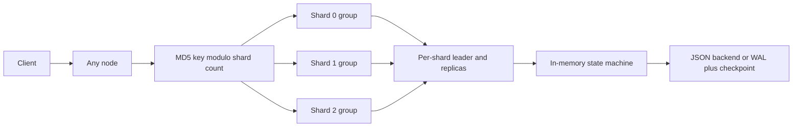

# Sharded Raft KV Store

[](https://github.com/96528025/distributed-kv/actions/workflows/ci.yml)

An experimental distributed key-value store built from scratch in Python. It runs an
independent replicated-log group per shard, built around selected Raft mechanisms. It
explores leader election, log replication, quorum-validated reads, snapshot compaction,
batched writes, cross-shard coordination,
crash recovery and observability without hiding the protocol behind a framework.

The project implements selected Raft mechanisms; it does **not** claim complete Raft
safety today. Election hard-state durability and candidate log freshness are covered by
targeted regressions. Durable Raft log recovery, standard conflict repair and commit
tracking, shard-isolated snapshots, ordered apply and failure-safe transactions remain
explicitly open. See [Correctness status](#correctness-status).

## Why this project is interesting

- **Real failures, not only mocks.** Tests start OS processes, pause an old leader with
  `SIGSTOP`, kill clusters with `SIGKILL`, restart nodes and corrupt storage files.
- **Invariant-driven debugging.** Every completed correctness case records the failure,
  the Raft property at risk, the fix and the regression that preserves it.
- **Crash-aware persistence.** The optional WAL uses framed checksummed records and an
  atomic checkpoint-before-truncate sequence.
- **Measured trade-offs.** Benchmarks preserve raw results and document variance, batching
  behavior, the Python GIL, connection overhead and single-host limitations.
- **Operational signals.** Each node exports bounded-cardinality Prometheus metrics for
  requests, elections, replication, snapshots, read barriers and transactions.

## Architecture



Every process hosts every shard and stores the full logical key space. Sharding distributes
leadership and replication work; it does not partition storage capacity. A write sent to any
node is routed to the relevant shard leader, replicated to a majority, applied locally and
persisted through the selected storage backend. A read is routed to the leader and refused
unless that leader can still contact a current-term majority.

[Architecture and engineering decisions](docs/ARCHITECTURE.md) documents request paths,
lock ordering, persistence boundaries, failure semantics and scaling constraints.

## Correctness status

| Status | What is established |
|---|---|
| **Verified** | `currentTerm` and `votedFor` survive restart before dependent replies; a node cannot vote twice in one term; RequestVote rejects a less up-to-date candidate. |
| **Verified path** | An isolated old leader refuses a read when it cannot confirm a majority in its current term. |
| **Verified storage behavior** | The WAL restores locally applied state after process crashes, repairs a torn final frame and fails closed on interior corruption. This is not Raft-log recovery or power-loss proof. |
| **Partial** | The read barrier closes the demonstrated stale-old-leader path but is not full ReadIndex and has no independent applied-index barrier. |
| **Open** | Durable Raft log recovery; `nextIndex`/`matchIndex` conflict repair; the current-term commit rule; shard-scoped snapshots; ordered apply; durable request deduplication; failure-safe 2PC; PreVote to contain the term inflation of a partitioned node. |

The detailed [Raft correctness log](docs/RAFT_CORRECTNESS.md) separates completed,
partial and pending cases. Known limitations are treated as engineering work, not hidden
behind feature claims.

## Run a local cluster

Requirements: Python 3.12+ and `curl`. The core server and test suites use only the Python
standard library.

```bash
./start.sh start

curl http://127.0.0.1:5001/set \
  -d '{"key":"hello","value":"world"}'

curl 'http://127.0.0.1:5002/get?key=hello'
curl http://127.0.0.1:5001/metrics

./start.sh stop
```

The launcher starts three nodes on ports `5001-5003` with the WAL backend. Runtime data
and exact PID files stay in ignored local directories. Set `KV_FSYNC=1` to request an
`fsync` for each committed storage batch.

To start one node manually:

```bash
python3 node_raft_sharded.py 5001 5002 5003 \
  --backend=wal --data-dir=.demo-data
```

Nodes bind to `127.0.0.1` by default. Cross-host experiments must opt in with
`--host=0.0.0.0` (or `KV_HOST`) and should run only on a trusted network; the HTTP and
internal replication endpoints do not provide authentication or transport encryption.

## Verification

CI runs 128 checks on Python 3.12 and 3.14. They are a deliberate mix of multi-process
integration tests, a real node driven by controlled peers and focused unit tests.

| Suite | Checks | Scope |
|---|---:|---|
| [`test_raft_sharded.py`](test_raft_sharded.py) | 56 | Three-process election, routing, replication, snapshots, restart, transactions and batching |
| [`test_raft_correctness.py`](test_raft_correctness.py) | 24 | C1/C2 assertions, crash durability, log freshness, topology checks and harness gates |
| [`test_wal.py`](test_wal.py) | 17 | WAL replay, torn tails, corruption, checkpoints and two converged-cluster `SIGKILL` cycles |
| [`test_metrics.py`](test_metrics.py) | 9 | Metrics primitives, bounded labels, instrumentation and a live scrape endpoint |
| [`test_txn_routing.py`](test_txn_routing.py) | 5 | Leader hints, unreachable fallback, lock conflicts and phase-two participant routing |
| [`test_read_quorum.py`](test_read_quorum.py) | 4 | Read-barrier logic plus a three-process isolated-old-leader regression |
| [`test_http_contract.py`](test_http_contract.py) | 13 | Single-node election, request-body validation and `/get` query parsing |

Run the same gate locally:

```bash
python3 test_metrics.py
python3 test_raft_sharded.py
python3 test_raft_correctness.py
python3 test_txn_routing.py
python3 test_read_quorum.py
python3 test_http_contract.py
python3 test_wal.py
```

## Persistence and observability

The WAL frame is deliberately simple and inspectable:

```text
MAGIC(4) | payload length(4) | versioned JSON payload | CRC32(4)
```

Checkpoint publication follows `write temp -> fsync -> atomic replace -> fsync directory
-> truncate WAL`. Recovery deduplicates records using each shard's applied index. The
storage WAL recovers the local state machine; it is intentionally separate from the still
open durable-Raft-log work.

`GET /metrics` exports Prometheus text without an external library. Labels exclude keys,
values, request IDs and transaction IDs to keep cardinality bounded. See the
[metric contract and suggested alerts](docs/OBSERVABILITY.md).

## Benchmarks

The repository includes repeatable workload drivers, raw CSV/JSON artifacts and methodology
notes for concurrency, batching, shard distribution and storage write amplification:

- [Consensus-path benchmark methodology](benchmarks/README.md)
- [Storage benchmark methodology](benchmarks/storage_benchmark.md)
- [`benchmark_raft_sharded.py`](benchmark_raft_sharded.py)
- [`benchmark_storage.py`](benchmark_storage.py)

The preserved consensus-path results are historical and predate the current read-quorum
path. They are useful for methodology and batching observations, not a current performance
claim. Absolute numbers come from three server processes and the client sharing one laptop;
they must not be extrapolated to a multi-host deployment.

## Project map

| Path | Purpose |
|---|---|
| [`node_raft_sharded.py`](node_raft_sharded.py) | Current sharded node: elections, replication, reads, snapshots, batching and 2PC experiment |
| [`storage.py`](storage.py) | JSON compatibility backend plus framed WAL and atomic checkpoints |
| [`metrics.py`](metrics.py) | Thread-safe metrics primitives and Prometheus rendering |
| [`raft_harness.py`](raft_harness.py) | Deterministic process and controlled-peer test harness |
| [`docs/ARCHITECTURE.md`](docs/ARCHITECTURE.md) | Request flows, failure semantics, lock ordering and decision record |
| [`docs/RAFT_CORRECTNESS.md`](docs/RAFT_CORRECTNESS.md) | Fixed, partial and open Raft correctness cases |
| [`docs/EVOLUTION.md`](docs/EVOLUTION.md) | Concise evolution from naive replication to the current design |

Earlier v1-v4 prototypes and the chat demonstration remain available in Git history rather
than competing with the current implementation on the default branch.

## Prioritized roadmap

1. Persist and recover the Raft log before acknowledging dependent RPCs.
2. Implement per-follower `nextIndex`/`matchIndex` and the current-term commit rule.
3. Make snapshots shard-scoped and serialize state-machine apply by log index.
4. Add a complete read barrier and history-based linearizability checks.
5. Add durable request deduplication and recoverable coordinator/participant decisions.
6. Only then evaluate a persistent transport and controlled multi-host benchmarks.

The project is intentionally correctness-first: reproduce a failure, name the violated
property, implement the fix, keep the regression and state what remains unproven.
