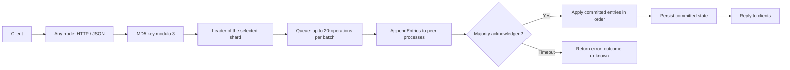

# Distributed KV — Replication, Recovery, and Failure Testing

[](https://github.com/96528025/distributed-kv/actions/workflows/ci.yml)
[](https://github.com/96528025/distributed-kv/actions/workflows/ci.yml)
[](LICENSE)

A Python key-value store with per-shard leaders, replicated in-memory logs, batched writes, and an optional write-ahead log for local applied-state recovery. The default demo runs three processes on one machine and accepts client requests at any node.

Each node stores every key. Sharding separates coordination groups; it does not partition storage capacity. The implementation covers a documented subset of Raft, with open safety issues tracked in [RAFT_CORRECTNESS.md](docs/RAFT_CORRECTNESS.md).

## Engineering highlights

| Capability | What the code does | Where to inspect it |
| --- | --- | --- |
| Replicated writes | Per-shard leader routing, concurrent peer RPCs, majority acknowledgements, batches of up to 20 queued operations | [`node_raft_sharded.py`](node_raft_sharded.py): `batch_loop`, `_handle_set`, `_handle_delete` |
| Election recovery | Persists each shard's term and vote before dependent replies; refuses stale-log candidates and a changed persisted shard count | `persist_hard_state`, `_handle_vote`; [`test_raft_correctness.py`](test_raft_correctness.py) |
| Stale-leader rejection | Requires same-term quorum confirmation before a leader serves `/get`; an isolated old leader returns `503` | `confirm_read_quorum`; [`test_read_quorum.py`](test_read_quorum.py) |
| Storage recovery | CRC32-framed committed-operation WAL, SHA-256-verified checkpoints, torn-tail recovery, idempotent replay | [`storage.py`](storage.py), [`test_wal.py`](test_wal.py) |
| Ordered application | Applies every entry covered by a commit, including earlier entries whose client requests timed out | `apply_committed`; [`test_apply_order.py`](test_apply_order.py) |
| Operational visibility | Dependency-free Prometheus counters, gauges, and histograms with bounded labels | [`metrics.py`](metrics.py), [`docs/OBSERVABILITY.md`](docs/OBSERVABILITY.md) |

CI runs **152 checks across nine suites on both Python 3.12 and 3.14**, including real node processes, leader suspension, full-cluster process kills, and disk corruption. These are scenario-specific regressions; they do not establish complete Raft safety or production readiness.

## Run in five minutes

Prerequisites: Python 3.12+, Bash, and curl on macOS or Linux. There are no third-party runtime or test dependencies. Run commands from the repository root.

```bash
./start.sh start

curl -X POST http://127.0.0.1:5001/set \
  -H 'Content-Type: application/json' \
  -d '{"key":"hello","value":"world"}'

curl 'http://127.0.0.1:5002/get?key=hello'
curl http://127.0.0.1:5001/health
curl http://127.0.0.1:5001/metrics

./start.sh stop
```

The launcher starts ports `5001–5003`, waits for leaders, selects the WAL backend, and stores logs/PIDs in `.run/` and data in `.demo-data/`. To request an `fsync` after each committed batch, start with `KV_FSYNC=1 ./start.sh start`.

For manual process control, each node needs its own command; this starts only the first node:

```bash
python3 node_raft_sharded.py 5001 5002 5003 --backend=wal --data-dir=.demo-data
```

Nodes bind to `127.0.0.1` by default. Client requests and replication RPCs share one HTTP port without authentication or TLS.

## Architecture and request flow



Each process hosts all three shard groups. Each group has its own term, vote, leader, log window, commit index, and application position; the process uses a shared key-value store. This is fixed modulo sharding, with no dynamic membership, rebalancing, or consistent-hash ring.

**Write.** A follower forwards the request to its known shard leader. The leader appends queued operations, sends its retained log window to peers concurrently, waits up to one second for a majority, and applies/persists committed entries before replying. A timeout leaves the entries in the log: a later successful replication round may commit them. There is no client request-ID deduplication, so a timeout is not proof that a write was aborted.

Followers relay the leader's HTTP status and JSON object response, adding `forwarded_by`. A missing key returns `404` through either the leader or a follower. An unreachable leader or an unusable upstream response produces `503`. The forwarding timeout is 0.5 seconds, while the leader's majority wait can take up to one second; a forwarded request can therefore time out before the leader finishes. A timeout does not establish whether a write was committed.

**Read.** A follower forwards `/get`. The leader probes peers with current-term `AppendEntries`, checks that a majority still recognizes its term, and steps down if a higher term is observed. This prevents the tested isolated-old-leader stale read. It is a quorum-validated leader read, with full ReadIndex/application-barrier semantics still open.

**Compaction.** A shard whose log exceeds 20 entries may compact its applied prefix. A follower behind the retained window can install a snapshot. Snapshots currently contain the shared store, so shard isolation during snapshot installation remains a tracked correctness gap.

**Transactions.** `/txn` groups operations by shard and performs prepare followed by commit or abort. Prepare follows leader hints and stages key locks/intents in memory with a 10-second monotonic lease. Phase two targets the participants that actually prepared. The coordinator does not validate every phase-two result; `status: "ok"` means the coordinator reported success, not that a durable atomic transaction was established. This path is an experimental, non-durable 2PC implementation.

## Persistence: three different kinds of state

| State | Purpose | Durability behavior |
| --- | --- | --- |
| Raft hard state | Remembers `currentTerm` and `votedFor` per shard | Temporary file, `fsync`, atomic rename; persisted before dependent replies; corrupt state refuses startup |
| Raft snapshot | Compacted state for follower catch-up | Stores the compaction boundary; current shared-store snapshot scope is tracked as C7 |
| State-machine WAL | Restores committed key-value operations | Frames contain magic, length, versioned JSON, and CRC32; optional per-commit `fsync` |

The WAL is **not a durable Raft replication log**: uncommitted Raft entries are not persisted. Checkpoints record the store and per-shard applied indexes, use a SHA-256 digest, and publish via `fsync` plus atomic rename before truncating the WAL. Rotation occurs at 1,000 records or 8 MiB. Replay skips already-applied indexes.

Recovery rejects the tested checksum and framing corruption without modifying the WAL;
an incomplete final frame can be truncated. These checks do not detect every possible
corruption pattern. Hard-state recovery also rejects a changed shard count. See
[persistence boundaries](docs/ARCHITECTURE.md#persistence-boundaries) for the exact scope.

Default WAL appends flush to the OS; `KV_FSYNC=1` requests stronger disk durability. Process-kill tests exercise process-crash recovery, not physical power-loss recovery. See [`docs/ARCHITECTURE.md`](docs/ARCHITECTURE.md) for locking and persistence ordering.

## HTTP API

| Method | Path | Behavior |
| --- | --- | --- |
| `POST` | `/set` | Set a string key/value through the shard leader |
| `GET` | `/get?key=...` | Quorum-validated leader read |
| `POST` | `/delete` | Delete a key; absent keys also succeed |
| `POST` | `/txn` | Experimental multi-key 2PC; see transaction limitations above |
| `GET` | `/health` | Per-shard role, leader, term, and log-window state |
| `GET` | `/metrics` | Prometheus text exposition |
| `GET` | `/all` | Local inspection dump without a quorum check |
| `GET` | `/debug/raft` | Detailed state, available only with `RAFT_TEST_MODE=1` |

Metrics cover HTTP counts/latency, elections, leader transitions, read-quorum outcomes, replication latency, snapshots, transaction outcomes, and per-shard state. Keys, values, and request IDs are excluded from labels. The transaction-success label is deliberately `reported_ok`.

## Tests and evidence

Run the same suites as [CI](.github/workflows/ci.yml):

```bash
python3 test_metrics.py
python3 test_raft_sharded.py
python3 test_raft_correctness.py
python3 test_txn_routing.py
python3 test_read_quorum.py
python3 test_http_contract.py
python3 test_wal.py
python3 test_apply_order.py
python3 test_timers.py
```

| Suite | Checks | Evidence |
| --- | ---: | --- |
| `test_raft_sharded.py` | 58 | Three-node integration: elections, forwarding, snapshots, follower restart, transactions, reads, batched writes/deletes |
| `test_raft_correctness.py` | 24 | One real node with scripted peers: term/vote crash recovery, log freshness, snapshot boundary, topology rejection |
| `test_wal.py` | 21 | WAL replay, corruption, torn tails, rotation, checkpoints; three-node cluster killed twice with `SIGKILL` |
| `test_http_contract.py` | 13 | Single-node election, malformed client input, URL-encoded keys |
| `test_apply_order.py` | 13 | Ordered/idempotent application, earlier timed-out entries, restart, compaction, snapshot catch-up |
| `test_metrics.py` | 9 | Metric primitives, concurrency, hooks, live scrape |
| `test_txn_routing.py` | 5 | Leader hints, fallback discovery, conflicts, repeated IDs, participant routing |
| `test_timers.py` | 5 | Wall-clock changes do not change election or lock-lease timing |
| `test_read_quorum.py` | 4 | Quorum decisions and real `SIGSTOP`/`SIGCONT` stale-leader regression |

The test suites exercise real node processes, leader suspension, process restarts, WAL corruption, checkpoint recovery, HTTP contracts, transactions, and ordered application. The checks establish the behavior of those scenarios; they do not prove complete Raft safety.

`test_raft_sharded.py` prints its passing-check count and exits unsuccessfully if any check fails. It manages only the node processes it starts and keeps generated state in a temporary directory. Cleanup does not terminate nodes from other checkouts.

## Measured performance and its limits

- **Storage-only benchmark:** the committed July 23 run uses 1,000 writes per point and the median of three trials. JSON throughput falls from approximately 1,400 to 28 ops/s as the store grows from 100 to 50,000 entries; WAL p50 append latency remains approximately 0.008 ms. This excludes HTTP and replication and is not an end-to-end durability claim. A second Linux run records the same trend. [Method and results](benchmarks/storage_benchmark.md).
- **Historical cluster benchmark:** on one laptop with the JSON backend, median throughput rises from 192 ops/s at concurrency 1 to 647 at concurrency 50, while p99 rises from 12 to 358 ms. The concurrent trials vary widely. This run predates quorum reads and has no batching-disabled control, so it does not measure current capacity or isolate a batching speedup. [Raw results and caveats](benchmarks/README.md).
- **No demonstrated multi-host scaling:** the same historical run is slower with keys spread across three shards than with one shard. Leader placement, CPU use, and batch depth were not controlled well enough to assign a cause.

Optional local benchmark smoke runs:

```bash
python3 benchmark_storage.py --quick --no-save
python3 benchmark_raft_sharded.py --quick --outdir /tmp/kv-bench
```

## Current scope and next work

The [correctness log](docs/RAFT_CORRECTNESS.md) records eleven cases: four closed, one partially addressed, and six open. Outstanding work includes durable Raft logs (C3), per-follower suffix repair (C4), the current-term commit rule (C5), request deduplication/timeout semantics (C6), shard-scoped snapshots (C7), full ReadIndex (C9), and PreVote (C10). Crash-safe transaction decisions are also absent.

This is a local systems project with no frontend, hosted service, authentication, or TLS. Its strongest evidence is the implementation and regression trail, rather than a claim of production-grade consensus.

## Code and documentation guide

Start with [`node_raft_sharded.py`](node_raft_sharded.py), then [`storage.py`](storage.py) and [`raft_harness.py`](raft_harness.py). For a guided failure investigation, read [the stale-leader lesson](docs/LESSON_01_READ_QUORUM.md) or [the transaction-routing lesson](docs/LESSON_02_TXN_LEADER_CHANGES.md).

[Architecture](docs/ARCHITECTURE.md) · [Correctness log](docs/RAFT_CORRECTNESS.md) · [Observability](docs/OBSERVABILITY.md) · [Project evolution](docs/EVOLUTION.md)

## License

MIT. See [LICENSE](LICENSE).
