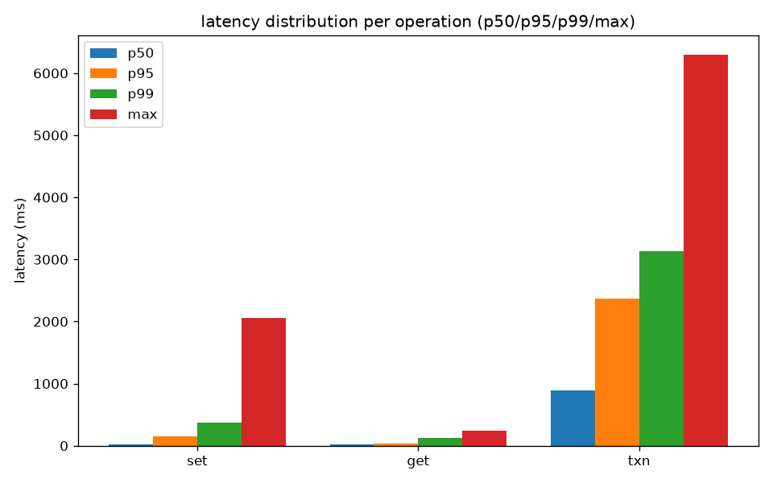
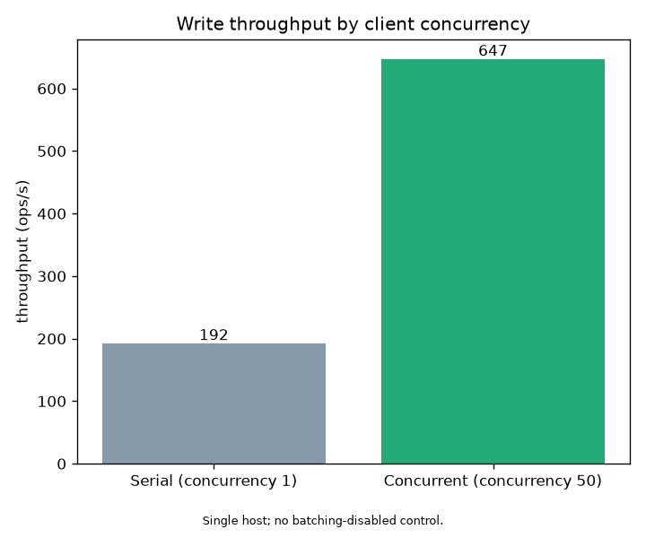
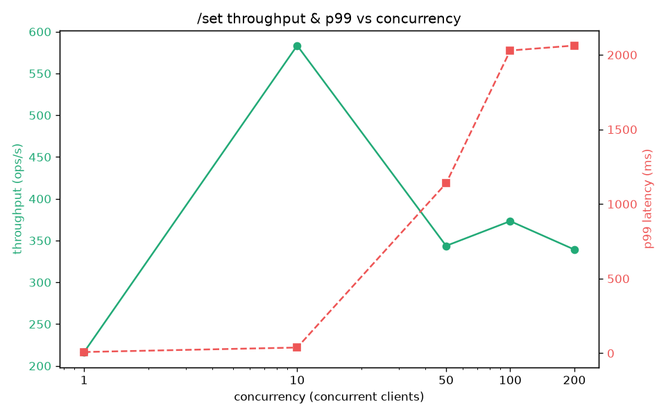
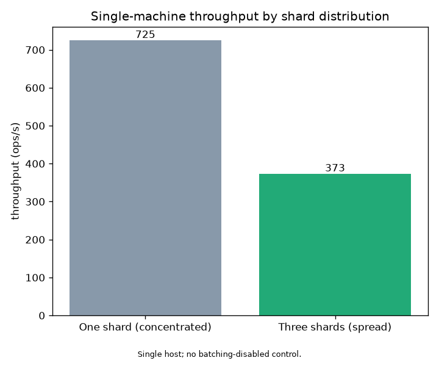

# Sharded Raft KV concurrency benchmark

This benchmark exercises `node_raft_sharded.py`, which combines hash-based
sharding with one Raft group per shard. The driver is
[`benchmark_raft_sharded.py`](../benchmark_raft_sharded.py).

```bash
# Start and reset a three-node cluster for each measurement, then save JSON,
# CSV, and optional charts.
python3 benchmark_raft_sharded.py

# Reduced smoke run.
python3 benchmark_raft_sharded.py --quick

# PNG generation is optional; JSON and CSV require no third-party packages.
python3 -m pip install matplotlib
```

The preserved run used three node processes and the benchmark client on one
laptop, Python 3.14, and HTTP/1.0 with JSON. Its absolute values describe this
single-host Python configuration and should not be generalized to a multi-host
deployment.

The results were recorded on July 23, 2026, before the current read-quorum
barrier was added. At the time of this run, `/get` was routed to the shard
leader but did not pay the cost of the current quorum validation. The current
implementation uses quorum-validated leader reads; it is not presented as a
complete ReadIndex implementation, and this project does not claim that the
historical read measurements establish linearizability.

## Methodology

| Decision | Implementation | Rationale |
|---|---|---|
| Concurrency model | `ThreadPoolExecutor`; worker count equals configured concurrency | Each worker issues blocking HTTP requests, so the pool bounds requests in flight. |
| HTTP client | Standard-library `urllib` | The server defaults to HTTP/1.0 and closes every response, so connection pooling would not reuse persistent connections. |
| Leader routing | Resolve each key's shard leader before a measurement and send requests directly to it | Removes follower-forwarding variability from the comparison. |
| Starting-state isolation | Restart node processes and clear their data and snapshot files before each managed measurement | The recorded run used the default legacy JSON backend, which rewrites the full store on each commit; accumulated application data would bias later measurements. |
| Warm-up | Write a small batch and wait for each shard to elect a leader | Excludes initial election and cold-start work from timed requests. |
| Repetition | Run comparison arms N times and report the median-throughput run | Reduces the influence of individual single-host scheduling spikes while retaining per-run values in the raw metadata. |

Latency percentiles are calculated from end-to-end request durations, including
TCP connection setup. Throughput is successful requests divided by wall-clock
time. Raw values are available in [`results.json`](results.json) and
[`results.csv`](results.csv).

## Variance and scope

Single-host throughput varied substantially even after repeated runs. In one
configuration, five measurements at the same concurrency ranged from roughly
250 to 1,400 ops/s. Relevant sources of variance include:

1. Three server processes and the client thread pool compete for the same CPU.
2. Python's GIL limits parallel execution within each process.
3. HTTP/1.0 creates a new TCP connection and server thread for every request.
4. Elections may place three shard leaders on one, two, or three node processes.

The benchmark is therefore useful for comparing paths within this environment
and for identifying orders of magnitude. Stable absolute capacity measurements
would require isolated hosts, controlled leader placement, repeated trials, and
host-level resource measurements.

## Preserved results

The run used 1,500 requests per test and five repetitions per comparison point.

### 1. Operation throughput and latency at concurrency 50

| Operation | Throughput | p50 | p95 | p99 | max | Path measured |
|---|---:|---:|---:|---:|---:|---|
| **`/get` (historical leader-routed read)** | **~2,400 ops/s** | 16 ms | 36 ms | 124 ms | 238 ms | Direct leader routing and an in-memory read; this run predates the current quorum-validation barrier. |
| **`/set` (batched write)** | ~700 ops/s | 27 ms | 149 ms | 375 ms | 2.0 s | Batch queue, Raft replication, and full-store persistence. |
| **`/txn` (cross-shard 2PC)** | **~45 ops/s** | 890 ms | 2.4 s | 3.1 s | 6.3 s | Prepare and commit across participants; some requests aborted under load. |



In this historical run, reads were faster than writes, and transactions were
the slowest path. The paths perform materially different work, and the read
number does not include the quorum-validation cost in the current implementation.

### 2. Batch-write comparison

| Scenario | Throughput | p50 | p99 |
|---|---:|---:|---:|
| Serial writes (concurrency 1; one request per Raft round) | ~190 ops/s | 5 ms | 12 ms |
| Concurrent writes (concurrency 50; up to 20 requests drained from the queue per round) | ~330–650 ops/s | 22 ms | 358 ms |



In the recorded median run, concurrent load raised write throughput 3.37x
(192 -> 647 ops/s) while increasing tail latency; the five concurrent trials spanned
250-1,480 ops/s, and no trial ran with batching disabled as a control. `BATCH_MAX_SIZE=20` caps the
number of queued requests drained into one round. `BATCH_TIMEOUT=5ms` is the idle
condition wait; notification wakes the worker as soon as a request arrives, so it does
not create a deliberate 5 ms collection window.

### 3. Write throughput versus concurrency



Throughput increased from concurrency 1 to 10 as requests began to batch. At
concurrency 50, 100, and 200, throughput in repeated runs was roughly
700–1,200 ops/s while p99 latency increased. The sawtooth shape is consistent
with substantial single-host scheduling, connection, and leader-placement
variance; this benchmark does not isolate the cost of any one subsystem.

### 4. Concentrated versus spread shards

Both arms used the same three-node cluster and replication factor:

- **Concentrated:** every key hashes to shard 0.
- **Spread:** keys are distributed across all three shards.



The single-host run did not show a throughput gain from spreading writes; the
ratio was often below 1. Three factors affect this result:

1. Spreading requests reduces each shard's batch-queue depth, which can produce
   smaller batches and more Raft rounds.
2. All node processes still compete for one host's CPU and other resources.
3. Random leader placement can concentrate shard leadership on one or two node
   processes.

The architecture permits shard leaders on separate machines to use separate
host resources, but these preserved results do not validate multi-host scaling.
That claim would require a controlled multi-host experiment with leader
placement recorded or balanced.

## Known measurement constraints

This benchmark measures the complete Python, HTTP/1.0, JSON, consensus, and
storage path. It does not isolate the following costs:

1. HTTP/1.0 connection setup and per-request server-thread creation.
2. JSON encoding, Python execution, and GIL-related scheduling.
3. Full-store rewrites by the legacy JSON persistence backend.
4. Queueing and shared replication rounds when concurrent requests accumulate.

Persistent HTTP/2 or gRPC connections, protobuf serialization, and the WAL
backend are reasonable follow-up experiments, but their effect should be
measured rather than inferred from this run.
